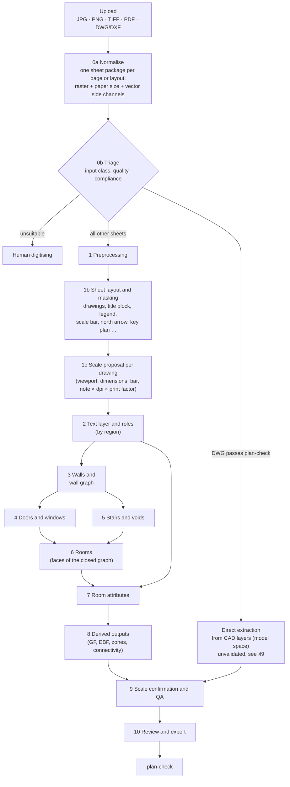

# Floor Plan Extraction Pipeline

*Technical design · Draft 0.3 · October 2026 · The canonical target concept: what the pipeline should do for any plan a user uploads. Based on [motivation and goals](motivation-goals.md), the [literature review and state of the art](literature-review.md), the [Landgut Lohn pilots](../pilot/v2-pipeline/README.md) and the reviews in [docs/reviews](reviews/README.md). Bracketed numbers refer to the shared [source list](../research/sources.md).*

*Changes in 0.3 ([review of 7 October 2026](reviews/2026-10-07-pipeline-target-inputs-masking-scale.md)): any upload is normalised into one sheet package per page or layout; a sheet-layout stage isolates each drawing with a polygon and a mask; the pipeline runs per drawing, not per sheet; the scale is proposed per drawing before segmentation and confirmed after; DWGs are rendered as plotted.*

## 1. Purpose and Scope

The pipeline turns floor plans into structured, validated floor data for BBL's area management:

- room outlines with attributes (AOID or room number, usage, area; where the room tag shows them, SIA usage category, room height and materials);
- walls (exterior, interior, load-bearing where it can be told), doors (every type, including empty door openings without a leaf), windows, columns, beams where drawn, stairs, ramps and voids;
- building systems such as elevators and escalators, and furniture where drawn;
- the gross floor area (GF) per floor, proposals for the energy reference area (EBF) and zones;
- the room-connectivity graph.

**Inputs are whatever users upload:** raster images (JPG, PNG, TIFF, also multi-page and 1-bit), PDFs (vector, raster or both on one page) and DWG/DXF files. Most of them are print products: construction drawings and facility-management plans with title blocks, legends, several drawings per sheet, noisy vectors and no reliable layers.

Results are written to the CAD-Richtlinie BBL layers, so that [plan-check](https://github.com/bbl-dres/plan-check) validates them like any delivered DWG, and to an open JSON format.

Out of scope: BIM authoring (IFC is derived from the 2D result), complete furniture inventories (furniture is extracted only where drawn), building-condition assessment.

## 2. Design Principles

1. **Structural, graph-based.** Walls first, rooms last. Rooms are the faces of the closed wall graph, not segmentation blobs.
2. **Raster-canonical, vector-assisted.** Every page or layout is rendered to one raster that all learned stages read. Vectors are kept as side channels for what they do exactly: native text, paper size, dimension geometry, viewport scales, snapping. Exact vector extraction is used only where the file is known to be clean (DWGs that pass plan-check).
3. **Per drawing, not per sheet.** A sheet can hold several drawings, a title block, legends and a key plan. Each drawing gets its own polygon, mask, storey and scale; everything outside it is masked.
4. **Scale before segmentation, confirmed after.** The scale is proposed per drawing from the cues on the sheet before the segmenter runs, and confirmed by stamp areas and element sizes once rooms exist. Disagreeing cues are flagged, never resolved silently.
5. **Each part does what it is good at.** Geometry comes from pixel-precise methods, meaning from OCR and VLMs, consistency from rules. VLMs locate and read; they never measure.
6. **Style-independent.** Models are trained on vector data rendered in randomised graphical styles, including construction-drawing and FM-plan content; each sheet's legend is read.
7. **Nothing is filled in silently.** Every element carries its source and a confidence with a reason; low confidence goes to review.
8. **Data stays in Switzerland.** All components are self-hostable; open source is preferred. Under Art. 9 EMBAG, BBL's own pipeline code is published as open source.

## 3. Overview

Stages 1–9 run once per drawing region of type floor plan; stages 0a, 0b, 1b and the title-block reading run once per sheet.

**User workflow.** People confirm the pipeline's proposals at a few checkpoints and otherwise only review what is flagged, following the [workflow design study](<wireframes/261007_Viewer and Workflow UX study.html>):

| Step | User sees and does | Stage |
|---|---|---|
| Upload | Drops sheets (PDF, images; several storeys at once); processing stays on the machine or BBL's servers | 0a |
| 1 Building area | Confirms the detected drawing outline per sheet and adjusts it so the title block, legend and other drawings stay out | 1b |
| 2 Scale | Checks the detected scale together with the resolution (scale note, title block or scale bar, highlighted on the sheet); corrects it by measuring a known distance where needed | 1c |
| 3 Storeys | Orders the drawings by storey, then starts the extraction | 0b, 8 |
| Results | Reviews only the flagged rooms and voids (e.g. area far from the stamp, stamp not read), edits them, and exports JSON, DWG, PDF, Excel (IFC later) | 9, 10 |

Each checkpoint is skipped when the pipeline is confident (e.g. a DWG viewport scale, one drawing per sheet) and shown when it is not.

## 4. Data Model

One JSON document per sheet (page or DWG layout). Coordinates of drawing elements are in plan metres of their drawing (georeferencing to LV95 is optional, see reference points). Every element carries `source` (`vector`, `cv`, `ocr`, `vlm`, `human`) and `confidence` (`high`, `medium`, `low`, with a reason).

| Entity | Key fields | CAD-Richtlinie layer |
|---|---|---|
| `sheet` | Source file and page or layout, input class, paper size (mm) and its source, raster resolution (px per paper mm), graphical style, drawing type (construction, FM, historical…), title-block metadata (building, plan number, date, author, revision), transforms source ↔ paper ↔ pixels | `V_PLANLAYOUT` (title block) |
| `regions[]` | Class (drawing, title block, legend, scale bar, scale note, north arrow, notes, revision table, frame, key plan, stamp, colour key, other), polygon in pixels and paper mm, source (`dwg-viewport`, `pdf-vector`, `detector`, `rule`, `human`), links (drawing ↔ caption, legend ↔ drawings) | – |
| `drawings[]` | Region, kind (floor plan, section, elevation, detail, site plan, key plan), title, storey, scale (value, print factor, cues, confidence, confirmed), north angle, reference points (REF.PKT, LV95), mask; the elements below belong to a drawing | – |
| `text[]` | String, polygon, angle, region, role (room stamp, dimension, level, axis label, title block, legend, caption, other) | `R_AOID`, `V_TEXT` |
| `legend[]` | Swatch (hatch angle, spacing, colour), meaning, matched elements | – |
| `walls[]` | Centre line, thickness, polygon, kind (exterior, interior, unknown), load-bearing (yes, no, unknown), construction (massive, lightweight; from legend or heuristic) | `A_ARCHITEKTUR`; massive walls `A_SCHRAFFUR` |
| `doors[]` | Type (hinged, double, sliding, folding, revolving, empty door opening without a leaf), host wall, position, width, swing, the two spaces it connects | `A_ARCHITEKTUR` |
| `windows[]` | Type, host wall, position, width, the space it belongs to. Kept apart from doors; balcony and patio doors are doors | `A_ARCHITEKTUR` |
| `structure[]` | Kind (column, beam), outline; beams: axis line, usually drawn dashed overhead, so low priority and flagged for review | `A_ARCHITEKTUR` |
| `stairs[]`, `ramps[]` | Outline, flights or slope, direction, void | `A_ARCHITEKTUR` |
| `systems[]` | Kind (elevator, escalator, other large building-system component), outline | `A_ARCHITEKTUR` |
| `furniture[]` | Kind, outline | – |
| `voids[]` | Outline, area, kind (staircase opening, elevator shaft, technical shaft, air space, light well), deducted from GF | `R_RAUMPOLYGON-ABZUG` |
| `rooms[]` | AOID or room number, name, usage, SIA usage category, stamp area, room height, materials (as tagged), polygon (inner wall faces, SIA 416), net area (from the polygon), gross area (from the geometry, including the room's share of the walls, e.g. to the wall centre lines), neighbours, review flag. Net, gross and stamp areas are kept side by side, never merged | `R_RAUMPOLYGON`, `R_AOID` |
| `axes[]` | Label, family, line | `V_ACHSEN` |
| `floor` | GF polygon (outer wall faces, voids cut out), EBF proposal, zones | `R_GESCHOSSPOLYGON` |
| `qa[]` | Check, severity, affected elements, message | – |

## 5. Stages

Pilot figures refer to [pilot v1](../pilot/landgut-lohn-og1/README.md) (one floor, a 2005 CAD print and a historical 1:50 scan, classical CV tuned on the test sheets) and [pilot v2](../pilot/v2-pipeline/README.md) (a U-Net trained only on style-randomised Swiss Dwellings renders, on three unseen sheets, plus public benchmarks).

### 0a. Normalisation

Every upload becomes one **sheet package** per page or DWG layout. All later stages read the package, never the original file.

- **Raster:** the page rendered or scanned, at a recorded paper resolution; 8-bit greyscale (1-bit inputs expanded), plus a colour copy where colour carries meaning (zones, revisions).
- **Paper:** page size in millimetres and its source (PDF page box × UserUnit, DWG layout paper size, TIFF tags, or inferred from the frame).
- **Vector side channels** (optional): paths with stroke width, dash, colour, fill, layer or optional-content group; text runs with string, font, height, rotation and box, flagged when outlined (geometry only) or invisible (a scanner's OCR layer); embedded images with their placement; DWG viewports with their scale and clip boundary.
- **Transforms:** source ↔ paper millimetres ↔ pixels, and later one plan transform per drawing.

| Input | Typical problems | Handling |
|---|---|---|
| JPG, PNG | DPI missing or a 72/96 default; photos with perspective | DPI trusted by source (scan header > paper-size match > metadata), never a screen default; photos flagged at triage |
| TIFF | Multi-page, 1-bit CCITT G4, very large | Split pages; expand 1-bit; tile at native resolution |
| PDF, vector | Outlined text (SHX fonts always become geometry); partial text layer; markups in annotations; single-precision coordinates | Render per page at a resolution chosen from the smallest text height (the pilot needed 1,200 dpi); render with and without annotations; outlined text goes to OCR; text-layer coverage judged per role, not per file |
| PDF, raster or mixed | A page image, perhaps with an invisible OCR layer; scans with vector redlines | Classify each page by content (vector, raster, mixed); treat images as scans; keep redlines as overlay masks |
| DWG/DXF, compliant | Rare in the archive | Model space at 1:1 (plan-check: millimetres, model space only, no xrefs, title block on `V_PLANLAYOUT`) → direct extraction, plus a render for review |
| DWG/DXF, delivery or print | Random layers, exploded blocks, unclosed rooms; content split across paper-space layouts and viewports at different scales; per-viewport frozen layers; missing xrefs; no plot style file | Render each paper-space layout as plotted; every viewport becomes a drawing region with an exact scale and clip boundary. Model space only if there are no layouts (then expect several plans side by side). Require the complete package (eTransmit); flag missing xrefs; default monochrome plot style |

- **DWG reading** goes through a swappable `DWG → DXF` converter, then ezdxf (MIT), which reads DXF and renders layouts. Converter candidates and their licences are in §6; none is decided (§9). DXF is accepted directly.
- **PDF reading:** PyMuPDF (AGPL-3.0) or the permissive pair pypdfium2 (rendering) and pdfplumber (paths and text); pikepdf for page-level objects such as measurement viewports.

### 0b. Triage and Input Quality

A CV model only works on clear, undistorted plans with an indication of scale; Archilogic's conversion requirements are a useful checklist.\[93\] Correctable defects are fixed in stage 1; only sheets that preprocessing cannot fix go to rescanning or human digitising.

| Requirement | Check | If not met |
|---|---|---|
| One floor per drawing region (several drawings per sheet are normal) | Stage 1b, title block, captions | Split into drawing regions; multi-page files into pages |
| Scale reference: dimensions, scale bar, scale note, viewport scale | Stage 1c | Scale proposal from priors + human check (stage 9) |
| Resolution high enough to see door and window extents, wall thickness and room text | Paper resolution, text height in pixels | Re-render (vector), rescan or human digitising |
| Scanned flat: no photos, perspective, folds or warping | Skew and warp estimate | Dewarp (stage 1); otherwise rescan or human digitising |
| A real 2D plan, not a schematic diagram, top-down 3D view or out-of-scale sketch | Triage classifier or VLM; "nicht massstäblich" / NTS notes | Human digitising |
| Colour markings and stamps do not hide walls or openings | Colour and overlay detection | Occlusion mask and flag, or human digitising |
| Title block and legend readable (storey, scale, date, meaning of hatches and colours) | Stage 1b + OCR | Enter the metadata by hand |

Routing by input class (expected quality is an estimate until the evaluation in §8 measures it):

| Input class | Detection test | Primary extractor | Secondary / fallback | Expected quality |
|---|---|---|---|---|
| DWG with structured layers/blocks | Passes plan-check or matches a known author profile | Direct extraction: ezdxf rules (layers, blocks, attributes, TEXT) | Raster path on the render, for comparison | Unvalidated: CAD layers are often messy even in compliant files; must beat the raster path on the render (§9) |
| DWG/DXF from delivery or print | Unknown or mixed layers, layouts, exploded blocks | Raster path on the plotted layouts; viewport scales and native text as side channels | Symbol spotting on primitives without layers ([literature review §6.1](literature-review.md#61-vector-symbol-spotting-and-primitive-graphs)) once vector labels exist | Medium |
| Vector PDF | Paths on the page | Raster path on the render; native text where present, OCR elsewhere | Path snapping for wall faces | Medium–high |
| Raster PDF, scans, images | No usable paths | Raster path + OCR | VLM for reading difficult stamps | Medium–low |
| Old scans, hand-drawn, annotated | Noise, skew, handwriting | Human-in-the-loop digitising with ML assistance | kraken or VLM for hand lettering | Low for full automation |

- Tag the graphical style (black-and-white, colour, solid or hatched walls, hand-drawn) and the **drawing type** (construction drawing, FM plan, historical survey, competition or permit plan) for routing and per-stratum evaluation.
- **Direct extraction from compliant DWGs:**
  - Room polygons: prefer existing closed polylines on `R_RAUMPOLYGON`. Otherwise polygonise wall faces after snapping endpoints (tolerance 1–5 cm), bridge door openings, then filter by area.
  - Room stamps: AOID or room number, usage (DE/FR/IT) and area in one block or a cluster of TEXT entities. Group by proximity and block membership, parse as in stage 7, assign by point-in-polygon; flag rooms with zero or several stamps.
  - Layer mapping per CAD author pays off only for large groups of DWGs that share one layer profile;\[16\] otherwise use the raster path.

### 1. Preprocessing

- **Raster:** deskew (and record the rotation in the transform), dewarp (UVDoc), binarise where useful, separate colour overlays; tile at native resolution with overlap (an A0 sheet at 300–400 dpi is 10–14k px).
- **Colour:** keep a colour copy for zones, revisions and legends; the segmenter sees the greyscale or colour raster as trained.
- *Pilot v2:* deskew of 0.48° on a historical scan, recorded in the output.

### 1b. Sheet Layout and Masking

Isolates the content that matters. Output: `regions[]` and `drawings[]` (§4).

- **Classes:** drawing (floor plan, section, elevation, detail, site plan, key plan), title block, legend, scale bar, scale note, north arrow, notes, revision table, frame, stamp or seal, colour key, other.
- **Polygons, not boxes:** plans are L- or U-shaped, and title blocks or legends often sit inside a drawing's bounding box. Each drawing box is refined with the ink inside it (building components plus dimension chains, minus the other regions).
- **Sources, in order:**
  - from the file where it has them: DWG viewports (exact clip boundary and scale), PDF frames, title-block tables and optional-content layers;
  - a detector on the raster: RF-DETR with a mask head (Apache-2.0), from COCO weights (document-layout pretraining hurt on drawings), with a second high-resolution pass for small objects (north arrow, scale bar, captions);
  - rules as a zero-label baseline and for pre-labels: frame as the largest rectangle, title block as a ruled table in a corner, drawings as ink clusters.
- **Swiss priors** for detection and for synthetic sheets: SIA 400 puts the title block bottom right with plan number, scale(s), revision index, date and format, and key plan, north indication, drawing scales and legends in fields above it; CADexchange 4.3 makes a graphical scale, a north arrow and a key plan mandatory in the title block, requires a cut edge enclosing all content, and allows the title block to be scaled on small formats (so its size is no calibration).
- **Captions:** each drawing is linked to its caption ("Grundriss 1. OG 1:100"), which gives title, kind, storey and the drawing's own scale note.
- **Title block:** detect, crop at full resolution, then OCR with key–value parsing (building, plan number, storey, scale, date, revision); a fine-tuned, self-hosted VLM where layouts vary. Zero-shot VLMs do not localise title blocks reliably.
- **Masks in inference:** stages 3–8 run only inside drawing polygons of kind floor plan (plus a margin for dimension chains). Key plans, details and title-block linework never become walls or a second building.
- *Evidence:* region detection reached title block 0.97–1.00 and drawing 0.94–1.00 with a few hundred to 1,400 labelled sheets in three studies; cropping to the drawing raised two baselines by 4–6 mIoU.
- *Pilot v2:* the drawing region of the CAD print was drawn by hand; the scans have one drawing each.

### 1c. Scale Proposal per Drawing

The segmenter works at one resolution (50 px/m), so each drawing needs a scale before stage 3.

- **Model:** metres per pixel m = N · 25.4 / (1000 · d · r), with N the drawing scale (1:N), d the resolution in dpi, and r the reproduction factor of the print (1 for the original; 0.5 for an A1 sheet copied to A3). Dimension strings, scale bars, area stamps and element sizes measure m directly; a scale note gives N only and needs d and r. SIA 400 expects reductions in √2 steps and requires them to be labelled.
- **Cues, in trust order, all recorded:**

| Cue | Source | Precision | Typical failure |
|---|---|---|---|
| DWG viewport scale, model units | DWG/DXF | Exact | Custom viewport scales, wrong INSUNITS |
| Reviewer two-point calibration | Review | Exact for a reliable distance | Wrong reference |
| Dimension strings paired with dimension lines | Text channel or OCR + lines | Best automatic cue | Pairing errors, chains, cm with superscript mm, OCR factor 10, out-of-scale values |
| Scale bar | Detector, full-resolution crop, OCR of labels | About ±1 px per end | Bar belongs to another drawing |
| Scale note × resolution × print factor | Caption, title block | Exact if N, d and r are right | Reduced prints, default DPI, several scales per sheet |
| Stamp areas vs. polygon areas | After a first room pass (stage 9) | A few per cent | Stale stamps, area conventions |
| Element sizes (doors, stair treads, WC cubicles) | After detection | 10–30% | Monumental and historical buildings |
| Sheet frame, page size | Frame detection, PDF page box | Good for d and r on standard sheets | √2 ambiguity of A formats |
| Embedded PDF measurement scale (`/VP`) | PDF | Exact if correct | Missing or wrong |

- **Consensus:** enumerate discrete hypotheses jointly (units; OCR factors of 10; print factor in √2 steps; N from the SIA/ISO list), score them by inliers among the direct cues, fit x and y separately on dimension strings (anisotropic copies), snap to a standard scale only when the print factor is trusted, auto-accept within about ±1%, otherwise send to review.
- **Per drawing:** each region uses its own caption note and its own dimension strings; the title-block scale is only the sheet default. Never pool dimension strings across drawings.
- **Flags:** cues disagree; one cue or priors only; reduced or enlarged print suspected (note vs. direct cues off by a power of √2); anisotropy above 1%; several scales on the sheet; drawing without its own scale; "nicht massstäblich"; mixed units; DPI missing or a default.
- *Pilot v2:* `fpx/scale.py` implements five cues and the consensus per sheet. On 40 CVC-FP scans it found a scale on 39 (median error 2.9%), and it identified the 2005 CAD print as a reduced print (note 1:100, drawing measured about 1:290).

### 2. Text Layer

- Native text from DWG and vector PDF; OCR on the render everywhere else and where the text layer is partial (PP-OCRv6; PaddleOCR-VL or kraken for difficult or hand-lettered text). Merge by overlap.
- Keep every string with its polygon, angle and region, and classify its role: room stamp, dimension, level, axis label, caption, title block, legend, other. The region decides first (title block, legend, drawing), the content second.
- Text inside drawings is not masked for the learned segmenter, which is trained with text on the renders; masking is needed only for classical baselines.
- *Pilot v1:* room stamps and dimension lines running through rooms split rooms into fragments (classical CV).

### 3. Walls and the Wall Graph

- **Wall mask:** a segmentation model (U-Net/HRNet class, trained on style-randomised renders, with interior, room-boundary, void and text heads in model v2); for clean CAD a stroke-width filter; solid (poché) walls directly.
- **Wall bodies:** fill the strips enclosed between double wall outlines.
- **Centre lines:** skeletonise the wall mask into a graph (nodes: junctions and ends; edges: wall segments with thickness).
- **Regularise:** snap to dominant directions, merge collinear segments, close small gaps at junctions; where vector side channels exist, snap wall faces to vector segments that pass an ink check in both directions.
- **Classify** exterior and interior walls (outer contour) and massive or lightweight construction from the legend where it exists, otherwise by thickness and fill (flagged as a heuristic).
- *Pilot v1:* stroke-width filtering reached wall IoU 0.61 on the CAD print. Junctions fragmented, window openings split the exterior wall into piers, and tiled stoves, fireplaces and stair stringers came out as walls.
- *Pilot v2:* the trained segmenter reached wall IoU 0.87 on the CAD print and 0.58 on the poché scan (v1: 0.36). Ceiling stucco drawn inside rooms was partly read as walls.
- *Pilot v2, code review:* gaps the segmenter leaves in a wall are bridged from the sheet's ink: from every wall end a ray runs to the next wall within 2 m, and the piece is drawn when a band of the wall's own thickness holds ink along 60 % of it or more (outlined, hatched and solid walls all do; a door leaves only its jambs). Bridged pieces are flagged for review. Degree-2 nodes left by spur pruning are contracted, so a straight wall is one segment; thickness no longer carries the distance transform's +1 px. Walls are classed exterior or interior from what lies on either side of their centre line (stage 8).

### 4. Doors and Windows

- Candidates come from two sources: symbol detection (door swings, windows; rotated boxes; a permissively licensed detector such as RF-DETR) and gaps between collinear wall ends in the wall graph.
- Fuse both: every door and window is hosted by a wall. Door or window follows from symbol and host (exterior wall: window or balcony door; interior wall: door, including empty door openings); width from the gap, swing from the arc.
- Doors and windows are always separate classes, never one "opening" class. Empty door openings without a leaf are doors of their own type and count as connections.
- *Pilot:* windows, balcony doors and interior doors use the same swing symbol, so position decides. Wide openings without door leaves merged neighbouring rooms.
- *Pilot v2, code review:* the host wall is found along the segment's extended centre line (centre lines stop at the jambs, so an opening's centre lies off the end by half its width): hosts for 10 of 42 openings on S1 before, 13 after, so hosting stays open until openings are intervals on a continuous wall graph (P3 of the code review). An open passage is accepted only between two wall ends that face each other; a wall end facing the flank of another wall is a corridor corner and was splitting corridors (oracle: 367 passages, 24 wrong, became 60 and 8). Interior openings drawn like windows no longer connect rooms.

### 5. Stairs and Voids

- Detect stair regions (repetitive tread pattern, detector class) and the direction arrow; include spiral stairs.
- Merge flights and landings into one stair object per floor; keep the void (Luftraum, Treppenauge) as its own polygon.
- Detect voids and shafts as their own objects: staircase openings, elevator shafts, technical shafts, air spaces over double-height rooms and light wells. Cues: the diagonal cross most plans draw over an opening in the floor, labels ("Luftraum", "LR", "Schacht", "Lift", "vide"), the elevator symbol, and the void head of the segmenter.
- Voids are not floor area; voids over 5 m² are cut out of the GF (CAD-Richtlinie).
- Later: link stairs across floors.
- *Pilot:* the main stair fell into three fragments plus the void. The stamp "17.98" probably excludes the void of about 5.2 m² (to verify).
- *Pilot v2, code review:* stairs are objects inside their room, not room boundaries (`stair_flights` on the room). The earlier convex-hull split cut 80 % of the staircases on Swiss Dwellings floors in two (most are enclosed by walls) and corridors with them; now a stair room is cut along the outline only when the stamps demand it (a stair stamp inside the outline, or stamps on both sides). Voids have a kind: a stair eye (the free space between the flights, under a void label) or an air space (a whole region labelled Luftraum/Vide, which is then no room); they are measured on the unclosed barrier, and the GF deduction applies to stair eyes over 5 m² and to every air space (plan-check's wording "Treppenaugen > 5 m², Lufträume"; to confirm with BBL).

### 6. Rooms

- Close every opening with a virtual wall; rooms are the faces of the planar wall graph (polygonise along the inner wall faces), within the drawing mask.
- Seed and check with room stamps: each stamp should fall into exactly one face. A face without a stamp is circulation, a shaft or unlabelled; a face with several stamps points to a missing wall or an open-plan area (then use the room-boundary head).
- Snap outlines to the inner wall faces (SIA 416 net area) and regularise. Every room of 0.25 m² or more keeps a polygon (CAD-Richtlinie); small unlabelled regions are flagged for review.
- *Pilot v1:* segmentation-based rooms reached mean IoU 0.76. The median area error dropped from 14.7% to 3.8% after a 10 cm snap to the wall face, which is why snapping is a stage of its own.
- *Pilot v2:* rooms as faces between walls and closed openings: 15/15 rooms, mean IoU 0.89, median area error 2.7% without snapping. On perfect labels of held-out Swiss Dwellings floors, free-space rooms reach recall 0.77; most misses are open-plan areas without a wall.
- *Pilot v2, code review:* the building mask keeps every enclosed region that holds a door or window (a second wing or building on the sheet), not only the largest; the stair split and the corridor-splitting passages are gone (above). On perfect labels of 120 held-out floors rooms went from recall 0.853 / precision 0.836 to 0.866 / 0.965, mean IoU 0.930 to 0.949, and the post-processing runs a third faster (slices instead of full-image passes per region). Traced contours are simplified by 0.6 px before the half-pixel offset, so polygons have tens of vertices instead of hundreds without an area bias. What remains with perfect labels is open plan: a separation-line head (centre-line report §10.7) is the next step, together with faces of the wall graph (recall 0.89 at precision 1.00 on oracle floors) reconciled room by room with the free-space regions.

### 7. Room Attributes

- Cluster text into stamps (proximity; block membership in DWGs), then parse: AOID (`WWWW.GG.EE.RRR`) or room number, usage (DE/FR/IT and abbreviations), area (`\d+[.,]\d+ m²`); an area with an explicit unit wins over bare numbers.
- Assign to rooms by containment, with a nearest-face fallback within a distance threshold.
- Normalise usage to the BBL taxonomy; a self-hosted VLM handles ambiguous text.
- Historical plans carry old room numbers: match them to SAP AOIDs by floor, position and area.
- *Pilot v1:* the VLM read 15/15 names and 14/15 stamp areas on the CAD print, and 11/11 handwritten names on the scan.
- *Pilot v2:* local OCR (PP-OCRv5 Latin) read 15/15 names and 12/15 areas on the CAD print; on calligraphy 0/11 exactly, 8/11 after vocabulary correction.

### 8. Derived Outputs

These outputs are not drawn as objects; they are derived from walls, rooms and openings.

- **GF per floor** (required, `R_GESCHOSSPOLYGON`): outer contour of walls and rooms at the outer wall faces (SIA 416); voids such as stairwell openings over 5 m² and air spaces cut out;\[95\] balconies and loggias excluded. One floor per storey: drawings of the same storey on several sheets are merged by reference points or grid axes.
- **EBF proposal:** floor areas inside the thermal envelope that need heating or cooling, to outer dimensions (SIA 380).\[96\] Plans rarely show which rooms are heated, so the proposal excludes unheated spaces by usage (e.g. garages, storage) and a person confirms it.
- **Zones** (fire compartments, security, rental or workspace zones): rooms grouped by attribute; where zones are drawn as colour overlays, as on fire-protection and FM plans, segmented by colour with the legend and confirmed by a person.
- **Room connections:** each door (of any type, including empty door openings) becomes an edge between the two rooms on either side, with the door's type and confidence on the edge; windows and interior openings drawn like windows connect nothing. A missed or misassigned door breaks escape-route, accessibility and workspace analyses, so door recall matters more than for other symbols.
- **Three areas per room** (§4): net at the inner wall faces (voids excluded), gross with the room's share of the walls, and the tagged area. The gross polygon comes from a partition of the wall band: every wall, column, door and window pixel goes to the nearest room, so neighbours meet at the wall centre line and an exterior wall is shared between the room and the outside (its outer half belongs to nobody). SIA 416 defines gross areas per storey, not per room; this per-room share is BBL's allocation rule and is written next to IFC's own net/gross quantities, never in their place.
- **GF and AGF:** rooms with outdoor usage (balconies, loggias, terraces) leave the GF outline once their usage is known; their area is reported as AGF.

### 9. Scale Confirmation and QA

- **Scale confirmation:** after the first room pass, stamp areas against polygon areas and element sizes confirm the proposal of stage 1c; a drawing whose scale moves by more than a few per cent is rerun once. The reviewer sees all cues, agreeing and disagreeing, and can override with a two-point calibration.
- **Cross-checks:**
  - stamp area vs. polygon area (flag above 3–5%) – the cheapest automatic QA signal; a deviation suggests a wrong polygon or a stale stamp;
  - every room has exactly one stamp;
  - GF exceeds the sum of room areas;
  - ground floor vs. the official survey (AV) footprint (e.g. converted with [av2geobau](https://github.com/claeis/av2geobau)), registered with the north arrow or reference points; floor count vs. the federal building register (GWR);
  - every opening is hosted by a wall; every room is reachable in the connectivity graph;
  - no element outside its drawing mask.
- **Confidence:** high, medium or low per element, with the reason. Each QA issue carries its own severity (error: wrong or unusable; warning: likely wrong, check; info: worth a look), separate from the element's confidence. The stamp is checked against the net and the polygon area (stamps often include a stair eye), with a tolerance of at least 0.3 m² so that a two-pixel band on a small room is not a finding.

### 10. Review and Export

- **Review:** overlay on the original sheet with its regions, filter by confidence, edit polygons, attributes, regions and the scale; a list of flagged rooms leads the reviewer (see the user workflow in §3). The [pilot viewer](../pilot/v2-pipeline/viewer.html) is a prototype that follows the workflow design study (sheet tabs, layers merged with the legend, a pinned inspector per room, a room list, stepping through flagged rooms, offline 2D and 3D); editing polygons, attributes and the scale is not built yet.
- **Export:** JSON following the data model (§4; a versioned schema will follow); DWG in predefined layers (today the CAD-Richtlinie layers `R_RAUMPOLYGON`, `R_AOID`, `R_GESCHOSSPOLYGON`, `R_RAUMPOLYGON-ABZUG`, `A_ARCHITEKTUR`, `A_SCHRAFFUR`, `V_TEXT`, `V_PLANLAYOUT`; the full layer set is to be defined), one file per floor, validated by plan-check (written as DXF, so a DXF-to-DWG step is needed); IFC with IfcOpenShell; PDF for review and distribution; Excel room and area lists.
- *Pilot v2, code review:* the export stage writes four files per drawing: the JSON (schema 1.0), the DXF on the CAD-Richtlinie layers, an Excel workbook (`fpx/xlsx.py`: Räume with net, gross and stamp areas and the review state, Geschoss, Öffnungen, QA, Meta) and an IFC 4.3 model (`fpx/ifc.py`: IfcSpace per room with Qto_SpaceBaseQuantities and a BBL property set carrying the stamp and wall-share figures, IfcWall per segment with Pset_WallCommon.IsExternal, IfcDoor and IfcWindow, IfcStairFlight, IfcColumn, IfcSlab with the deducted voids as openings, first-level space boundaries between doors and the rooms they connect; nominal heights from the configuration, marked as such; reproducible GUIDs). Hosting doors and windows in their walls as IfcOpeningElement follows once openings are intervals on the wall graph.
- **Learning loop:** corrections, including corrected regions and scales, become training data.

## 6. Components

Candidates per stage; the recommended starter stack and the full lists are in [open solutions](solutions-open.md#51-recommended-starter-stack); commercial products in [closed solutions](solutions-closed.md). Licences are to be confirmed before use; under Art. 9 EMBAG, BBL publishes its own code as open source, so copyleft dependencies are a question of BBL's outbound licence.

| Stage | Classical baseline | Learned candidate | Licence notes |
|---|---|---|---|
| Normalisation: PDF | pypdfium2 (render), pdfplumber (paths, text), pikepdf (page objects) | – | Apache/BSD, MIT, MPL; PyMuPDF AGPL-3.0 as an alternative |
| Normalisation: DWG → DXF | LibreDWG (sandboxed); QCAD Professional command-line tools; ODA File Converter | – | GPL-3.0; proprietary server licence; non-commercial use only for ODA non-members (to clarify) |
| Normalisation: DXF render | ezdxf drawing add-on (layouts, viewports) | – | MIT |
| Preprocessing | OpenCV deskew, binarisation | UVDoc (dewarp); Augraphy for training | MIT |
| Sheet layout | Frame and ruled-table rules, ink clusters | RF-DETR with mask head; fine-tuned self-hosted VLM for title blocks | Apache-2.0; check VLM licences |
| Scale | Dimension-string pairing, scale-note parsing, consensus (pilot `fpx/scale.py`) | Scale-bar and dimension detectors | – |
| Text | PP-OCRv6 | PaddleOCR-VL, kraken (hand lettering), self-hosted Qwen-VL (normalising) | Apache-2.0 |
| Walls | Stroke-width filter, skeleton (OpenCV) | U-Net/HRNet or Mask2Former on style-randomised renders | MIT / Apache-2.0 |
| Openings, stairs | Template matching, arc detection | RF-DETR | Apache-2.0; avoid AGPL Ultralytics YOLO |
| Rooms, graph | Shapely `polygonize`, networkx | GNN room classification (later) | BSD |
| Vector input (later branch) | ezdxf | VecFormer, DPSS-style fusion (train on own data) | Apache-2.0 code; DPSS academic only |
| Export | ezdxf, IfcOpenShell | – | MIT / LGPL |

## 7. Training Data

- **Renders of vector data in randomised graphical styles:** Swiss Dwellings (CC BY 4.0) and permissively licensed IFC models now; BBL DWGs that pass plan-check later (free labels for rooms, AOIDs, massive walls and GF; doors, windows, stairs and columns share `A_ARCHITEKTUR` and need extra labels).
- **Sheet content as explicit background:** frames, Swiss-style title blocks, legends with hatch swatches, key plans, notes, north arrows, scale bars and several drawings per sheet (renderer v2), with layout labels for the stage 1b detector.
- **Construction-drawing and FM-plan content:** dimension chains, axis grids, level markers, section and detail markers, door and room tags, material hatching per wall type, furniture; FM colour fills by usage and stamp formats of the CAD guidelines. Rendering BIM models as construction drawings is a candidate source.
- **Masks on real sheets:** annotate only inside drawing regions and set everything else to the ignore label.
- **Benchmarks only:** non-commercial sets (FloorPlanCAD, ArchCAD-400K, CubiCasa5K, CVC-FP) ([datasets](literature-review.md#7-datasets)).
- Prepared training data goes to [`data/`](../data/README.md); a curated set of varied plans for the viewer is in [`data/curated/`](../data/curated/README.md).
- Augraphy-style defects in the renderer (folds, shadows, bleed-through, fading, 1-bit dithering).
- *Pilot v2, second review:* renderer 3.0 draws the construction-drawing content above as a negative set (dimension chains on the facades and interior strings, section and detail markers, axis bubbles, door and window tags, level markers, furniture; all background, their lettering in the text head), fixes the casement/door confusion, labels shafts and lifts as voids and adds a door-swing head. Model v3 trained on it leads on FloorPlanCAD (mean of four 0.28 → 0.32, wall F1 0.39 → 0.41) and on CubiCasa doors (IoU 0.45 → 0.55); the frozen validation renders (`--val-cache`) make runs comparable ([model card](../pilot/v2-pipeline/MODEL_CARD.md)).

## 8. Evaluation

**Ground-truth sample.** 60–100 BBL sheets, stratified by input class and drawing type, with at least 10 sheets per graphical style; instance-level metrics (rooms, doors) add statistical power. Paired DWG and scan or print versions of the same floors give exact scale and geometry truth.

| Stratum | Sheets | Selection |
|---|---|---|
| DWG, well-structured | 15 | Several authors/eras |
| DWG, delivery or print (layouts, inconsistent layers) | 15 | – |
| Vector PDF (with / without text layer) | 15 | Include reduced prints |
| Clean raster | 10 | – |
| Old scans / hand-annotated | 15 | Worst case |
| Drawing types (cross-cutting) | Spread across all strata | Construction drawings, FM plans, historical surveys; several drawings per sheet |
| Graphical styles (cross-cutting) | Spread across all strata | Black-and-white, colour, solid wall fills, hatched walls, historical hand drawing |
| Building types | Spread across offices and historical buildings | Avoid residential bias |

Annotate in a vector tool (QGIS or CAD) to the data model (§4): regions and drawing polygons; scale per drawing; room polygons with number, usage and area; GF polygons; wall centre lines and thickness; door, window, column, stair, ramp and furniture instances; and the two rooms each door connects.

**Metrics** per stage, reported per input class, drawing type and graphical style:

| Stage | Metric |
|---|---|
| Sheet layout | Detection mAP per region class; 95th-percentile Hausdorff distance of drawing boundaries (paper mm); drawings per sheet correct; leakage (detections outside drawing regions) |
| Scale | Relative error per drawing against DWG truth; share auto-accepted; share flagged correctly |
| Walls | Wall IoU; centre-line precision/recall within 5 cm; thickness error |
| Openings, columns, stairs, furniture | Instance precision/recall/F1 per class at IoU ≥ 0.5 (or centre-distance tolerance); door swing accuracy; correct host wall |
| Voids | Detection rate; void area error |
| Rooms | Polygon IoU per room (one-to-one matching at IoU ≥ 0.5); room-level precision/recall/F1; area error (% and m²); rooms with exactly one stamp |
| Room attributes | Exact match per field (number, usage, area); character error rate; correct assignment |
| GF | Polygon IoU per floor; area error (%); voids found |
| EBF, zones | Share accepted without correction; area error after review |
| Room connections | Connectivity-graph F1 (doors of all types, including empty door openings); share of doors assigned to the correct two rooms |
| Overall | Human correction minutes per sheet – the decisive operational metric |

**Process.**
- Report per stratum and graphical style, never averaged across them: a pipeline that is excellent on DWGs and poor on scans is still the right choice for DWGs.
- Find the limits, not just the average: controlled degradation of rendered BBL DWGs (resolution, noise, style, print reduction); learning curves over the number of BBL training sheets (e.g. 10, 50, 200); a human baseline and inter-annotator agreement on the same images.
- Published metrics are not comparable across datasets and tasks, and are self-reported by authors or vendors.
- Benchmark vendors only on the non-sensitive sheets.
- Ground truth is what the plan shows. Agreement with the built reality needs its own check (CAFM/SAP areas, site visits or scans).

## 9. Open Questions

- **DWG converter and licences:** LibreDWG (GPL-3.0, sandboxed), QCAD Professional (server licence) or ODA File Converter (written confirmation that internal federal use is allowed, or membership); BBL's outbound licence under Art. 9 EMBAG.
- **Compliant DWGs: direct extraction or raster path?** BBL's experience is that model-space layers are messy even in delivered DWGs that pass plan-check (stray entities, open room outlines, inconsistent blocks), so rasterising the DWG and running the whole raster pipeline may give better results. Until a side-by-side comparison on compliant DWGs shows otherwise, the raster path on the render is the reference and direct extraction is only a candidate; DWGs keep viewport scales and native text as side channels either way.
- **Area conventions:** exact SIA 416 rules for room polygons (niches, radiator recesses, built-in cupboards) and what the stamp area includes (e.g. stair voids).
- **Accuracy targets** per use case (net-zero reporting, transactions, workspace planning), including the scale tolerance for automatic acceptance.
- **Wall types:** can legends be read reliably enough across styles?
- **Multi-storey linkage** (reference points, grid axes, stair cores) and georeferencing.
- **AOID structure:** which segments of `WWWW.GG.EE.RRR` encode the floor, for checking drawings against SAP.
- **Hardware:** self-hosted GPU sizing for training and inference.

## 10. References

- [Motivation and goals](motivation-goals.md): BBL's goals (archive data mining, deliveries, trustworthy data), lessons learned and the recommended route
- [Open solutions](solutions-open.md): open-source implementations, pipeline components and starter stack
- [Closed solutions](solutions-closed.md): commercial products and services
- [Literature review and state of the art](literature-review.md): methods, models, benchmarks and datasets; findings of the indexed papers by pipeline stage; [sources](../research/sources.md)
- [Reviews](reviews/README.md): [pipeline and pilot v2](reviews/2026-10-07-pipeline-and-pilot-v2.md); [inputs, masking and scale](reviews/2026-10-07-pipeline-target-inputs-masking-scale.md)
- [Research index](../research/README.md): papers grouped by approach family and strategy (the taxonomy in `research/papers.json`), e.g. Ahmed et al. 2011/2012, Liu et al. 2017 (Raster-to-Vector), Chen et al. 2023, Hu et al. 2024 (Raster-to-Graph)
- [Pilot v1](../pilot/landgut-lohn-og1/README.md) and [pilot v2](../pilot/v2-pipeline/README.md) (Landgut Lohn, 1. OG)
- [plan-check](https://github.com/bbl-dres/plan-check) and its [rules for the CAD-Richtlinie BBL V1.0](https://github.com/bbl-dres/plan-check/blob/main/docs/pruefregeln-de.md)
- SIA 400 (Planbearbeitung im Hochbau) and the CADexchange CAD-Basisrichtlinie 4.3 for title-block, scale and reference-point conventions
