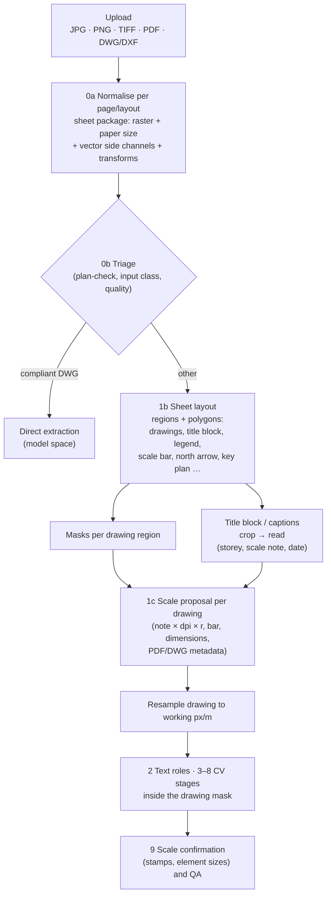

# Evidence for the Domain-Expert Review of the Pipeline Design

*Status: evidence brief as delivered on 7 October 2026 for the [review of the pipeline as canonical target](../reviews/2026-10-07-pipeline-target-inputs-masking-scale.md); its recommendations are implemented in [pipeline.md](../pipeline.md) draft 0.3, and the ★★ papers of §6 are in the research index.*

*Evidence brief · 7 October 2026 · Scope: [pipeline design](../pipeline.md) draft 0.2, stages 0–2 and 9, measured against BBL's goal of one canonical pipeline that turns any uploaded floor plan (JPG, PNG, TIFF, PDF, DWG) into rooms, walls, openings, areas and AOIDs in the CAD-Richtlinie BBL layers.*

*Method: read `docs/pipeline.md`, `docs/literature-review.md` (stages 0, 1, 2, 9; §5–§7), `docs/reviews/2026-10-07-pipeline-and-pilot-v2.md`, `research/papers.json`, the Markdown copies in `research/papers-md/` of every local paper cited below (figures are quoted from those copies), and pilot v2's `fpx/scale.py`, `fpx/triage.py`, `sheets.py` and README. External papers, standards and tools were found by web search and checked on their landing pages; §6 gives full metadata and verification status. No repository file was changed.*

*Conventions: local papers are cited by their `papers.json` id, e.g. `2024-pang-pixel-wise-symbol-spotting`. New papers carry `[E#]` (full metadata and verification status in §6); standards, documentation, tools and practitioner sources carry `[S#]` (§7). "Pilot" means pilot v2 (our own evidence, one building, not literature). Figures are the authors' own unless marked otherwise. External evidence was gathered with four research agents; their key claims (ODA licence, EMBAG guidance, CADexchange and SIA 400 clauses, FELD figures, 23 arXiv IDs and 23 DOIs) were re-checked for this brief, the rest is marked in §6–§7.*

## 0. Key Findings

1. **Rasterise for perception, keep vectors as side channels: the evidence supports the user's instinct.** Archive layers are messy (FloorPlanCAD; ArchCAD-400K kept 47% of industry drawings after layer screening), layer-dependent vector models lose much of their wall accuracy without layers (SymPoint-V2 wall PQ 80.8 → 49.3; VecFormer and DPSS degrade less), outlined text breaks vector graphs (VectorGraphNET), and CADSpotting itself rasterises vectors to close wall outlines. Every ablation found shows image + primitives beating either alone (DPSS 86.2 PQ vs 81.7 primitives-only and 80.9 image-only; FloorPlanCAD wF1 0.308 → 0.755 with render features; VectorFloorSeg 61.3 → 75.6 mIoU). So: one canonical raster per page for all learned stages; native text, exact paper size, dimension geometry, DWG viewports and snapping lines as side channels; a learned hybrid branch only later, once BBL has vector-labelled DWGs (§1).
2. **DWG: render what was plotted, not model space.** Viewports carry the scale and the clip region, per-viewport frozen layers hide content, xrefs may be missing, and plot-style files are usually not in the upload (Autodesk docs). Compliant BBL DWGs are the opposite case: model space only, millimetres, no xrefs, title block on `V_PLANLAYOUT` (plan-check). No permissive production-grade DWG reader exists: LibreDWG is GPL-3.0 (sandbox it), QCAD Professional's server licence permits service use, and the free ODA File Converter is "for non-commercial applications only" for non-members, which needs a written ruling for federal use. Under Art. 9 EMBAG BBL's own pipeline code must be published as open source anyway, which turns the GPL/AGPL question into a choice of outbound licence (§1.3).
3. **Add a sheet-layout stage (1b) with polygons and masks; it is missing from the design.** Region-first parsing is learnable from a few hundred to about 1,400 labelled sheets: title blocks at 0.97–1.00 and drawing regions at 0.94–1.00 in Pang et al., Lombardi et al. and FELD; cropping to the drawing raised two baselines by 4–6 mIoU (Lv et al.). RF-DETR (Apache-2.0) was best on FELD, and document-layout pretraining hurt. Use regions as inference masks and, in training, set non-drawing areas of real sheets to the ignore label while rendering title blocks and legends as explicit negatives on synthetic sheets (MapSeg and map practice; no floor plan dataset does this yet) (§2).
4. **Several drawings per sheet need per-drawing attributes.** Storey, title, scale and north angle belong to each drawing region, not the sheet. A bridge-drawing pipeline already names each view by its caption, e.g. "Draufsicht M. 1 50" [E4]; DWG viewports give the same structure for free (§2.4).
5. **Scale is per drawing, needed before segmentation, and best modelled as m = N · 25.4 / (1000 · d · r).** Separate the drawing scale N, resolution d and reproduction factor r. Dimension strings, scale bars, stamps and element sizes measure metres per pixel directly; notes need d and r. SIA 400 expects reductions in √2 steps and requires them to be labelled; ISO 5455 warns that a print's scale may differ from the original's. Fuse robustly (median/MAD or RANSAC, x and y separately), auto-accept only within about ±1%, and flag disagreement (§3). The pilot's `fpx/scale.py` already does most of this per sheet; the design document still places scale only in stage 9.
6. **Swiss title blocks are a strong prior.** CADexchange 4.3 makes a graphical scale, a north arrow and a key plan mandatory in the title block, requires a cut edge enclosing all content, and allows title blocks to be scaled on small formats; SIA 400 places the title block bottom right with scale and format fields and allows key plan, north, drawing scales and legends in additional fields above it (§2.2, §3.3).
7. **VLMs read, they do not locate or measure.** Fine-tuned open VLMs read the title-block scale field at 0.95–0.99 word accuracy, but failed to localise title blocks zero-shot, and zero-shot room areas were off by about 43% (§2.2, §3.2).
8. **Other features worth extracting:** storey label and drawing type (routing, floor assignment), legend entries (massive-wall classification for `A_SCHRAFFUR`), north arrow and Swiss REF.PKT reference points (LV95 georeferencing, storey stacking), grid axes (registration across storeys), key plans, section markers, revision clouds and stamps (masks and occlusion flags). No openly licensed plan dataset annotates any of these; BBL will have to label its own (§4).
9. **Evidence is thin where it matters most.** No paper evaluates scale recovery, sheet layout or masking on plans like BBL's; the strongest results come from bridges, façades, mechanical drawings, maps and microscopy. Several 2026 sources are preprints or posters.

**Proposed front end** (stages 0–2 of `docs/pipeline.md`, revised):

## 1. Input Normalisation: Parse Vectors, Rasterise, or Both

### 1.1 Findings from the Local Papers

**Archive vector data is noisy, and vector models depend on the layers that make it clean.**
- FloorPlanCAD's authors, working from real DWGs: "The layer name does not necessarily explains its content, and the layer content might be quite messy because there is no restrictions on what should be grouped as a layer." They converted DWG to SVG, removed all text, cut each plan into 10 m × 10 m blocks and kept 30% (`2021-fan-floorplancad`).
- ArchCAD-400K kept only 5,538 of 11,917 industry drawings (47%) after rejecting those whose layer names deviated more than 5% from a reference table: "Non-standard drawings can have ambiguous layer names and mixed primitives, leading to semantic confusion." Even the screened auto-labels needed correction by 10 drafters (`2025-luo-archcad-400k`).
- Without layer information, SymPoint-V2's wall-type ("stuff") PQ on FloorPlanCAD falls from 80.8 to 49.3, and it drops from 83.2 PQ on FloorPlanCAD to 60.5 on the more diverse ArchCAD-400K (`2024-liu-sympoint-v2`, `2025-luo-archcad-400k`; literature review §5.2).
- Graph descriptors of vector primitives are sensitive to noise, "as noise can affect the adjacency and Laplacian matrices of the graphs" (`2019-rezvanifar-symbol-spotting-survey`).
- Text drawn as geometry breaks vector graphs: VectorGraphNET's errors "predominantly occur in text that is not encoded as text in the document but rather converted into geometrical vectors", which "may not be apparent when examining the raster version" (`2024-carrara-vectorgraphnet`).
- Unclosed outlines: to get closed wall polygons from vector CAD, CADSpotting merges adjacent endpoints, renders the vectors to an 8K binary PNG with aligned coordinates, takes connected components and re-vectorises the boundaries, i.e. it rasterises to close the geometry (`2024-yang-cadspotting`, supplementary).

**Hybrid inputs beat either modality alone, in every ablation found.**
- DPSS (ArchCAD-400K baseline) on FloorPlanCAD: primitives only 81.7 PQ, rendered image only 80.9, both concatenated 83.0, both with adaptive fusion 86.2. Without layer or colour priors it reaches 70.6 PQ on ArchCAD-400K against 60.5 for SymPoint-V2, at about 30% more inference time (`2025-luo-archcad-400k`).
- FloorPlanCAD's GCN: weighted F1 0.308 with spatial and type features of the primitives, 0.755 once CNN features from the rendered drawing are added, 0.798 with the loss changes (`2021-fan-floorplancad`, Table 2).
- VectorFloorSeg: adding image features from the rasterised plan to the line-graph embeddings raised room mIoU from 61.32 to 75.60 in its ablation; the authors note that, "despite the equivalence of raster images and vector floorplans", raster features give a larger receptive field (`2023-yang-vectorfloorseg`; table partly garbled by the conversion, read as cumulative rows).
- Zhang 2026 checks vector candidates against the raster: an "ink gate" keeps a predicted wall only if at least 50% of samples along it have dark pixels within ±3 px, which admits hollow and double-line walls (`2026-zhang-readout-vectorization`). This is the cross-modal check needed to accept or snap geometry.

**Where vectors are clean, deterministic parsing is exact, and its rules are reusable.**
- Talebi-Kalaleh & Mei parse PDF drawing operators while tracking the transformation stack, line width, dash pattern, stroke and fill colours and painting operators; they recover arcs from flattened Béziers by circle fitting and keep text runs with rotation. Image-only PDFs are binarised (Sauvola) and traced into the same primitives, so "both paths feed the same geometric detectors, although only the vector path preserves a machine-readable text layer" (`2026-talebi-kalaleh-framing-plan-parsing`).
  - Line weights are split per drawing into hatch, medium and heavy classes from percentiles of the width histogram, which "reduces sensitivity to different pen tables".
  - Symbol thresholds are in paper millimetres ("drafters select printed symbol sizes for legibility"), structural thresholds in model metres.
  - Limits: all quantitative results are on 50 generated vector PDFs from the authors' own generator. In the illustrative raster example, no machine-readable text existed and the scale had to be supplied by hand.
- VectorGraphNET converts PDF to SVG and flattens all groups and transforms into plain paths before building its graph; its labels come from CAD layers following a public-sector layer standard (VHF Bayern), the same pattern as BBL's CAD-Richtlinie (`2024-carrara-vectorgraphnet`).
- Annotation cost favours images: "the annotation of CAD drawings requires that annotators should skillfully use a CAD software to group graphical primitives", and "a symbol maybe drawn from different layers in CAD drawings" (`2024-pang-pixel-wise-symbol-spotting`).
- Large sheets need windowing in either modality: CADSpotting's sliding-window aggregation beats non-overlapping blocks by 16.7 PQ on LS-CAD, and relies on instances keeping "consistent sizes across different scenes under uniform scaling" (`2024-yang-cadspotting`). Semap tiles map pages above 10,000 px into 768 px patches with 64 px overlap and infers at two resolutions (`2026-petitpierre-semap`).

**Pilot evidence (our own, one building).**
- The 2005 CAD print (vector PDF) had a partial text layer: dimensions and fixture words only, while room stamps were outlined and needed OCR. Its dimension text is under 1 pt high, so the page is rendered at 1200 dpi. The drawing region was drawn by hand (`pilot/v2-pipeline/sheets.py`, `fpx/triage.py`, pilot README).
- The two historical scans are 1-bit TIFFs at 400 dpi.
- Rendering the vector PDF and running the raster pipeline gave wall IoU 0.89 and 15/15 rooms on that sheet (review §2.1).
- PyMuPDF (AGPL-3.0 or commercial) is pinned in the pilot's requirements with a note to review it before offering a service.

### 1.2 Findings from New Papers

- **No new peer-reviewed method parses CAD-exported PDF paths into rooms** beyond VectorGraphNET and Talebi-Kalaleh & Mei (both local). CAD work almost always goes DWG → SVG (FloorPlanCAD, ArchCAD-400K), not via PDF (search result of this brief, not a paper finding).
- **Production-scale raster parsing with snapping exists.** SALI-FP processed 11,534 plans in a production audit (752,510 valid polygon-bearing objects), gates model edits on image evidence and uses "source-only affine registration to align predictions with linework", i.e. snapping to the drawing; scale is left to "project-specific" specification. Its CubiCasa5K scores are modest (mIoU 0.3596, room F1 0.445) [E28].
- **Rule-based CAD room extraction assumes what archive DWGs lack.** Wu et al. require DXF "organized by layers" with doors and windows as blocks, and restore wall lines cut by openings in three cases to close rooms [E40]. Yin et al. classify layers by their content instead of their names (94 drawings: "nearly all floor levels are detected", 88% of members "measured perfectly") [E39]. Both show that layer names are at best a weak feature.
- **Gap closing for unclosed outlines** has principled tools: kinetic extension of detected segments "until they meet each other" into a polygon partition (KIPPI) [E42], and face extraction from simple closed curves [E41]. They fit as refinements after raster segmentation, not as the primary room source.
- **Vectors given to a VLM are not a uniform gain.** SVG plus PNG "improves performance on spatial understanding tasks but often hinders spatial reasoning, particularly in pathfinding" (75 plans, three models) [E37]. Text fused with primitives helps symbol spotting [E38], which supports keeping native text as a side channel.
- **Do not cite** Tang et al. 2017 (PLOS ONE, "Automatic structural scene digitalization"), a "vector rules + raster repair" pipeline: it was retracted on 28 May 2025 [E44].

### 1.3 DWG and PDF Practice, Tools and Licences

**What the plotted sheet is** (Autodesk AutoCAD LT help [S9]):
- "A layout viewport is an object that is created in paper space to display a scaled view of model space"; a layout can hold several viewports at different scales; the viewport scale is the ratio of paper-space to model-space units.
- Layers can be frozen per viewport (VPLAYER); frozen objects are "not displayed, regenerated, or plotted". Model space therefore shows more than was printed.
- Xrefs can be Loaded, Unloaded, Not Found, Unresolved, Orphaned or Unreferenced; a DWG uploaded without its references is incomplete.
- Plot style tables (CTB by colour, STB by name) are "assigned to a layout or to the Model tab" but stored in the user's Plot Styles folder, not in the DWG; "lineweights are always plotted, even if they are not displayed" (default 0.25 mm). Printed line weights depend on a file the uploader rarely sends.
- Annotative objects plot at the same paper size "regardless of the viewport scale"; their model-space size depends on the active annotation scale.
- **CAD-exported PDFs:** "Text in SHX fonts is always converted to geometry"; the PDFSHX setting can add "AutoCAD SHX Text" comments or hidden text. PDF stores coordinates in single precision (AutoCAD's highest PDF export precision is 4800 dpi). Optional-content layers exist only if "Include layer information" was ticked at export. These facts explain the pilot's outlined room stamps and set the snapping tolerance.
- **PDF measurement viewports:** PDF 1.6+ pages can carry `/VP` viewport dictionaries with a `/Measure` dictionary (subtype `RL`, a human-readable ratio `R` such as "1 in = 10 ft", and X/Y/D conversion factors), defined in ISO 32000-1 §12.9 [S8]. A practitioner thread reports that AutoCAD "DWG to PDF" exports carry a scale that Acrobat's measuring tool picks up, but that it can be wrong (off by a factor in that case) [S10]. Read it as a cue, never as truth.
- **BBL's own rules for compliant DWGs** (plan-check, CAD-Richtlinie BBL V1.0 [S1]): drawing unit millimetres at 1:1 (GEOM_001), no paper-space layout tabs (LAYOUT_001, warning), frame and title block in model space on `V_PLANLAYOUT` (LAYOUT_002), no xrefs (GEOM_004). Compliant DWGs are therefore model-space-only; delivery DWGs that fail these checks are typically layout-based, xref'd and print-oriented.

**ezdxf** (MIT) reads and writes DXF R12–R2018 but not DWG; its drawing add-on renders paper-space layouts and accepts a CTB file and lineweight policies, with documented limits: "VIEWPORTS are always rendered as top view", ACIS entities are not rendered, OLE frames become rectangles. SHX fonts are supported since v1.1 when their paths are configured, but the FAQ says some backends render only SHX fonts with TTF equivalents (to test). Its xref module handles DXF only; `odafc` wraps an installed ODA File Converter (may need xvfb on Linux) [S11].

**Readers and renderers** (licences as found; checked on official pages unless marked):

| Tool | Licence | DWG / PDF coverage | Renders layouts? | Caveats for a Swiss on-premise setup |
|---|---|---|---|---|
| ODA File Converter [S12] | Proprietary freeware: "If you are not an ODA member, you can use them for non-commercial applications only" (checked) | DWG ↔ DXF, all versions | No (conversion only) | Whether internal federal use is "commercial" needs written confirmation from ODA. It "frequently returns exit code 0 even when a specific drawing failed" (open solutions catalogue); validate outputs |
| ODA Drawings SDK [S12] | Commercial membership; tiers from USD 3,000 first year (no web/SaaS use) to 7,500 (web/SaaS allowed) and 37,500 (source code) (agent, ODA pricing page) | All DWG versions | Yes (SDK) | Distribution rights end with the subscription |
| LibreDWG [S13] | GPL-3.0-or-later | Reads all versions, "some very advanced R2010+ objects" skipped; release 0.14 (27 Jun 2026); dwg2dxf about 90% coverage | No (dwg2SVG for "only some entities") | CVE history (e.g. CVE-2025-61154 heap overflow): run sandboxed on untrusted uploads |
| QCAD Professional [S14] | Proprietary; server licence CHF 479.96 per server, allows use "on a web server … as part of a web service" | Reads DWG R2.5–R2018 | dwg2pdf, dwg2bmp, dwg2svg per layout; viewport and CTB fidelity not verified | Underlying DWG library not stated |
| libdxfrw / LibreCAD [S19] | GPL-2.0-or-later | DXF; DWG read experimental | No | – |
| GDAL/OGR CAD driver (libopencad) [S18] | MIT/X11 | DWG R2000 only | No | Not a general DWG reader |
| Aspose.CAD [S15] | Commercial | Up to DWG 2018 (snippet only) | Layouts to PDF/raster (snippet only) | Not verified |
| Autodesk APS Model Derivative [S16] | Cloud service | DWG | Yes | Regions US, EMEA, AUS, CAN, DEU, IND, JPN, GBR; no Swiss region (snippet only) |
| DWG TrueView [S17] | Free, Windows, GUI | DWG/DXF | Plot, publish | Licence for automated or server use not verified; unsuitable unattended |
| PyMuPDF / MuPDF [S20] | AGPL-3.0 or commercial (Artifex: "You cannot deploy our open-source as part of a server-based application… without disclosing your own application's full source code") | PDF paths with width, colour and optional-content layer name; text; rendering | – | Licence choice, see below |
| pypdfium2 / PDFium [S20] | Apache-2.0 / BSD-3-Clause; PDFium BSD-style | Rendering, text | – | Permissive rendering alternative |
| pdfplumber / pdfminer.six [S20] | MIT | Characters, lines, rectangles, curves; decodes CCITT | – | No rendering |
| Poppler, Ghostscript [S20] | GPL; AGPL or commercial | Rendering | – | – |
| pikepdf [S20] | MPL-2.0 | Low-level PDF objects (e.g. `/VP`, annotations) | – | Does not render |
| Pillow, libtiff, tifffile [S21] | MIT-CMU; BSD-style; BSD-3-Clause | Multi-page TIFF, CCITT Group 3/4 (via libtiff or imagecodecs) | – | Pillow sets JPEG `dpi` only for JFIF files with inch units; TIFF dpi "where applicable" |

**Licences under Swiss federal rules.** The guidance note "Beschaffung von Software und Art. 9 EMBAG" (EFD / BBL / KBB, as of 11.06.2025 [S22]; checked) states that software developed by or for the Confederation must be published under an open-source licence, with only two narrowly interpreted exceptions (public security; existing third-party rights), and that the notion of software includes libraries, plug-ins, add-ons, smaller scripts and macros. For this pipeline that means (an inference, for BBL's legal service):
- Copyleft dependencies (LibreDWG GPL-3.0, PyMuPDF AGPL-3.0) are compatible in principle, provided BBL publishes its own pipeline under a compatible licence; the AGPL network clause then costs nothing extra. If BBL prefers a permissive licence for its code, use pypdfium2 and pdfplumber instead of PyMuPDF, and keep LibreDWG as a separate process.
- Proprietary converters (ODA, QCAD Professional, Aspose) can be bought as products and called across a process boundary; the code BBL writes around them still has to be published. The free ODA File Converter's non-commercial clause is the open question.
- Cloud converters (APS) fail the data-residency principle (pipeline principle 7).

### 1.4 What This Means for the Target Pipeline

**Recommendation: raster-canonical, vector-assisted.** Render or rasterise every page to one representation for all learned stages; keep the vectors as side channels and use them only for what they do exactly. The evidence supports the user's instinct to flatten noisy vectors, with one qualification: flatten for perception, but do not throw the vectors away.

1. **One canonical intermediate per page or DWG layout, the "sheet package":**
   - `raster`: the page rendered or scanned at a recorded paper resolution (px per paper mm); 8-bit greyscale (1-bit inputs expanded), plus a colour copy when colour carries meaning (zones, revisions);
   - `paper`: page size in mm and its source (PDF page box × UserUnit, DWG layout paper size, TIFF tags, or inferred from the frame);
   - `vectors` (optional): paths with stroke width, dash, colour, fill, source layer or optional-content group and entity handle; text runs with string, font, height, rotation and box, flagged when the text is outlined (geometry only) or invisible (a scanner's OCR layer); embedded images with their placement;
   - `regions` from stage 1b (§2.4);
   - `transforms`: source ↔ paper mm ↔ sheet pixels ↔ plan metres, one plan transform per drawing region (provenance, review §3.3).
   All learned stages read the raster, so one model, one renderer and one evaluation serve every input class. This matches the pilot (wall IoU 0.89 on a rendered CAD print) and avoids the layer dependence of vector models (§1.1).
2. **Use the vector channel for five things:**
   - text: strings and positions; the text layer can be partial (pilot S1), so OCR still runs on the render and the two are merged by overlap, as `fpx/text.py` already does;
   - scale: exact paper size, dimension text and lines measured in paper millimetres (Talebi-Kalaleh & Mei), DWG viewport scales, PDF measurement viewports as a cue (§3.4);
   - geometry refinement: after raster segmentation, snap wall faces and centre lines to vector segments that pass an ink-gate test in both directions (the segment lies on predicted wall, the predicted edge lies on the segment), within about one stroke width. Rooms remain regions of the raster-derived walls, so unclosed vector outlines never define a room;
   - region proposals: frames, title-block tables, DWG viewports, optional-content names (§2.4);
   - layer hints, but only for DWGs that pass plan-check or match a known author profile, the analogue of ArchCAD-400K's 5% screening.
3. **Keep a learned hybrid as a later branch, not the canonical path.** DPSS-style fusion of primitives and render is the strongest option where vectors exist (+4.5 PQ over primitives alone, +5.3 over the image alone), but it needs vector-level labels that only compliant BBL DWGs can supply, and DPSS's code and data are for academic use only. Evaluate it against the raster path on the same sheets once a labelled DWG set exists.
4. **Keep rule-based vector parsing for compliant DWGs only** (stage 0 direct extraction), where it is exact by construction. Do not polygonise noisy archive vectors into rooms by rules as the main route.
5. **Decide the licence of BBL's own pipeline code first.** Under Art. 9 EMBAG it will be published as open source anyway (§1.3), so the GPL/AGPL question for LibreDWG and PyMuPDF turns into a choice of BBL's outbound licence; the remaining licence risk is the proprietary DWG converter.

**Input specifics** (practice facts with sources in §1.2–§1.3):
- **PDF, per page:** read page boxes, rotation and user unit; read `/VP` measurement viewports and optional-content names when present (pikepdf or PyMuPDF). Classify by content into vector, raster (one image covering the page, possibly with an invisible OCR text layer) and mixed (a scan with vector redlines or a vector plan over a raster underlay). Render with and without annotations, because markups, clouds and stamps often live in annotations rather than in the page content. Detect outlined text (clusters of small closed paths with no text span) and route it to OCR. Respect page rotation and crop box. Choose the render resolution from the smallest text height (the pilot needed 1200 dpi for sub-1-pt dimension text), then resample to the working resolution once the scale is known. CAD-exported PDFs hold single-precision coordinates (at most 4800 dpi from AutoCAD), which bounds the snapping tolerance from below.
- **Multi-page PDF and TIFF:** split into pages first; each page is a sheet; keep the document grouping for storey ordering and duplicates.
- **Raster:** expand 1-bit (CCITT G4) images; treat DPI tags by source as the pilot's `DPI_TRUST` does; never trust 72 or 96 dpi defaults; flag photos and perspective at triage.
- **DWG** (no converter needed yet, but fix the interface now): a swappable `DWG → DXF` step, then ezdxf; accept DXF directly today. Candidates (§1.3): LibreDWG (GPL-3.0, run sandboxed), QCAD Professional's command-line tools (server licence permits service use), or ODA File Converter once ODA confirms in writing that federal internal use is allowed; never a cloud converter.
  - Compliant DWG (millimetres 1:1, model space only, frame and title block on `V_PLANLAYOUT`, no xrefs, per plan-check): model space at 1:1 → direct extraction, plus a render for review and QA.
  - Delivery and print DWG: render each paper-space layout as plotted (viewports with their scale and clipping, layers frozen per viewport, plot style and lineweights); each viewport becomes a drawing region with an exact scale. Fall back to model space only when there are no layouts, and then expect several plans side by side (split in stage 1b). Expect gaps and record them as flags: the CTB/STB file is usually missing (render with a monochrome default and randomise line weights in training), SHX fonts may be missing (keep the native text channel), ezdxf renders every viewport as a top view, and annotative objects depend on the viewport's annotation scale.
  - Xrefs: require the complete package (e.g. an eTransmit archive) and flag references that are Not Found or Unresolved, because the base plan often lives in an xref.
  - Native TEXT, MTEXT and block attributes go into the text channel, transformed into sheet coordinates.

## 2. Sheet Layout Analysis and Masking

### 2.1 Findings from the Local Papers

- **Region-first parsing works with a few hundred labelled sheets.** Pang et al. detect nine region classes on rendered CAD sheets (1,700 × 1,200 to 4,200 × 3,000 px; 300 training and 60 test images) with YOLOX, then locate symbols only inside the regions, calling this step "the layout analysis for CAD images". Precision / recall / F1 at IoU > 0.5: main drawing 1.00/1.00/1.00, main title 1.00/0.92/0.96, title bar 1.00/1.00/1.00, material list 1.00/1.00/1.00, legend 1.00/1.00/1.00, description text 1.00/1.00/1.00, direction angle (north arrow) 1.00/0.90/0.95, text with directional lines 1.00/0.98/0.99, scale text 0.97/0.97/0.97 (`2024-pang-pixel-wise-symbol-spotting`, Table I). Telecom equipment-room drawings from one source; 60 test images.
- **WAFFLE** fine-tunes DETR, starting from a document table detector (`TahaDouaji/detr-doc-table-detection`, Apache-2.0 tag, trained on the ICDAR 2019 table dataset), on 200 hand-labelled images with four classes: floorplan, legend, scale, compass; 80/20 split, 1,300 iterations on one GPU. No detection accuracy is reported. The boxes route OCR: text inside floorplan boxes becomes architectural labels, text inside legend boxes becomes legend entries, and legend areas are excluded when grounding legend keys in the plan (`2024-ganon-waffle`, App. B.2, C). WAFFLE's repository has no software licence (open solutions catalogue).
- **Cropping to the drawing measurably helps.** Lv et al.: "the effective floor plan area in the input picture may only account for < 50% of the area". Their YOLOv4 region detector reaches AP0.5 0.97 and AP0.75 0.90, and adding it to the baselines raises mIoU from 0.76 to 0.80 (Raster-to-Vector) and from 0.76 to 0.82 (DeepFloorplan); frequency-weighted IoU from 0.82 to 0.90 and 0.83 to 0.93 (`2021-lv-residential-floor-plan-recognition`, Table 1 and §5.1).
- **Title blocks are hard to read even once found.** Khan et al. detect nine annotation types, title blocks among them, with YOLOv11-OBB on 1,367 mechanical drawings and parse each crop with Donut. Title-block parsing reaches F1 72.9% with one shared model (55.7% with a class-specific model) and a hallucination rate of 27.1%, against 94.6% F1 for surface roughness; the authors attribute the weaker title-block recall to "the variability and complexity of title block layouts". The detector itself is not evaluated (`2025-khan-engineering-drawing-parsing`).
- **Rules can mask without a fixed crop.** Talebi-Kalaleh & Mei reject members with no bearing at either end, which "removes legend strokes and title-block rules without relying on a fixed crop defined by page location", and treat candidates outside the column bounding box inflated by 3 m as "drawing furniture". Their generated sheets include title blocks, revision strips, general notes, legends, keynote hexagons, load schedules, key plans, grid bubbles, dimension chains, section markers and north arrows: a template for synthetic sheets (`2026-talebi-kalaleh-framing-plan-parsing`).
- **Several items per page** is a solved pattern in document parsing: PP-StructureV3 adds a "layout region detection model" to its layout detector (PP-DocLayout-plus) because "a single newspaper page often contains several distinct articles", and elements are then assigned to their article (`2025-cui-paddleocr-3`). Several drawings on one sheet are the same problem.
- **Synthetic sheets should imitate frames and label positions.** Semap crops synthetic maps "along one edge or at a corner to imitate the map frame", and adds random text labels "to prevent the segmentation model from overfitting to the relative positions of text labels" (`2026-petitpierre-semap`). Schlagenhauf et al.'s generator adds a second image type so that the detector learns to tell dimensions from hatches, threads and text boxes (`2022-schlagenhauf-text-detection-drawings`).
- **Gaps (repository).** The literature review lists "several drawings on one sheet" as open gap 13; no paper splits a sheet into several drawings with a polygon each. The review of pilot v2 found that v2 keeps only the largest building, that about 20% of CubiCasa5K images hold several floors, and recommends splitting sheets at triage (review §3.3). The pilot's only vector-PDF drawing region was drawn by hand.

### 2.2 Findings from New Papers and Practice

**Sheet layout on AEC drawings (the closest analogues):**
- **FELD benchmark** [E1]: 551 façade drawing sheets from 10 projects, rasterised at 300 dpi (3,509 × 2,480 to 14,042 × 9,934 px), nine classes (title block, revision table, legend, notes, elevation, horizontal section, vertical section, GA section, GA plan).
  - mAP50 / mAP50:95: RF-DETR (m) 0.949 / 0.890; Faster R-CNN 0.930 / 0.779; YOLOv12m 0.871 / 0.755; Qwen3-VL-8B with LoRA 0.758 / 0.668 (best F1 0.911, but 6.1 s per sheet); DocLayout-YOLO pretrained on DocLayNet and DocSynth 0.675 / 0.589.
  - RF-DETR (m) mAP50:95 per class: title block 0.989, plan 0.969, revision table 0.932, legend 0.928, notes 0.734.
  - Pretraining on general documents hurt ("domain interference"): in the ablation, "both the architectural innovations and the document-specific pre-training weights of DocLayout-YOLO resulted in a performance degradation on the AEC dataset compared to the baseline", a COCO-pretrained YOLOv10m (Table 4).
  - Limits: inputs resized to 1,344 × 800 px, which the authors say loses thin lines; no data or code release.
- **Lombardi et al.** [E2]: 1,385 building drawings, four classes (title block, main content, legend, notes), Faster R-CNN with a MobileNetV3 backbone. Accuracy at IoU ≥ 0.7: title block 0.971, main content 0.943, legend 0.86, notes 0.82.
  - On 10 hard drawings, rule baselines (DBSCAN, template matching, adaptive thresholding) stayed below 15% accuracy on at least 8; Table Transformer and MTL-TabNet failed to split title blocks; GPT-4o given the whole sheet missed the title block on 6 of 10, but read cropped title blocks correctly (keys 86%, values 95% on 50 drawings).
  - Lesson: detect, crop, then read. The cloud model is not usable for internal BBL plans.
- **Peng et al. 2026** [E3], German bridge drawings (450 / 50 / 64): Qwen2.5-VL-3B with LoRA localises title blocks with P = R = F1 93.8% (mean IoU 0.871), YOLOv11-m with F1 93.1% and tighter boxes (mean IoU 0.951); zero-shot, the VLM did not localise at all. The base model's licence is "qwen-research".
- **Peng et al. 2025** [E4], 2,000 bridge drawings: a YOLOv7 view detector (validation mAP@.5 about 0.92); view titles found by k-means on font height and matched to views by containment, then intersection, then nearest centre; each view is cropped and named by its title, e.g. "Draufsicht M. 1 50". This is a working recipe for several drawings per sheet, each with its own scale.
- **Sheet routing:** Carrara, Nousias & Borrmann classify 450 German construction drawings by phase, discipline, representation (DIN 1356-1) and level (DIN 277): best average accuracy 0.853 with a graph attention network on vectors, 0.847 with a pretrained ViT [E5].
- **Mechanical and plant drawings:** views, title blocks and notes at normalised accuracy 0.96 / 0.99 / 0.98 with YOLOv11 on 1,000 drawings [E6]; four title-block regions at 89.5% mAP@0.5:0.95 on 250 test drawings, applied to about 770k files [E7]; about 74% for title-block detection and metadata identification with Tesseract [E8]; white-space clustering plus a small CNN, error-free on 53 mechanical test drawings [E9] but reported to fail on cluttered building drawings [E2]. An expired patent locates title blocks by grouping long lines in sheet corners (98% claimed on A4) [S26], usable as a rule baseline.

**Maps: content-area masks are standard practice.**
- ICDAR 2021 MapSeg, task 2 segments the map content area of each sheet as a binary mask, scored by the 95th-percentile Hausdorff distance (winner 19 px; others 85–126 px; 26 / 6 / 95 sheets up to about 10k × 10k px). Task 1 ships an input mask, and "only predictions within this area is to be kept". Data CC BY 4.0 [E10].
- Luo et al. remove predictions outside the map area with an "enclosure" mask (largest contour, filled) [E12]; DIGMAPPER segments map content and legend areas with a fine-tuned LayoutLMv3 (map area IoU 0.83, F1 0.86 on good maps; legend items F1 0.88) and restricts all extraction to the map mask; its synthetic data overlays symbols on real map content [E11]. LayoutLMv3 weights are CC BY-NC-SA 4.0, so this exact model is not reusable.
- PEACE detects seven map components (title, scale, legend, main map, index map, cross section, stratigraphic column) with YOLOv10 on about 1,000 maps, without detection metrics [E16]. Gede & Varga find frame corners with a Hough transform plus filters: corner error under 1% of the sheet size on 89% of 1,147 topographic sheets [E15].

**Swiss sheet conventions** (priors for detection and for synthetic sheets):
- SIA 400:2000 [S3] (checked in the French edition): the title block sits bottom right, 5 mm from the trim; its fields include the plan number, scale(s), revision index, date and "format du plan"; additional fields above it may hold the key plan ("schéma de repérage"), the north indication, the scales of the individual drawings, legends and layer names.
- CADexchange CAD-Basisrichtlinie 4.3, client version Basel-Stadt (December 2024) [S2] (checked): every plan has a cut edge ("Schnittrand") that encloses all plan information, with nothing outside it; DIN A formats or multiples of A4; the PDF extends at least 5 mm beyond the visible plan edge; the title block must contain a graphical scale, a north arrow and a key plan of the site; its size "kann bei kleineren Planformaten skaliert werden". BBL is a CADexchange member (review §6.3), so this is the likely template for BBL-commissioned sheets.

### 2.3 Models, Licences and Masking Practice

| Model or data | Code / weights licence | Training data (licence) | Use for stage 1b |
|---|---|---|---|
| RF-DETR (incl. segmentation) | Apache-2.0 for the core models; "Plus" sizes under PML 1.0 | COCO init, DINOv2 backbone | Recommended: best on FELD; masks give polygons |
| RT-DETR / RT-DETRv2, D-FINE, Detectron2 | Apache-2.0 | COCO / Objects365 | Alternatives; Mask R-CNN for polygons |
| Ultralytics YOLOv8/11/12, DocLayout-YOLO | AGPL-3.0 (DocLayout-YOLO's weight card says Apache-2.0: conflicting) | COCO; DocSynth-300K (no licence declared) | Avoid; DocLayout-YOLO was worst on FELD |
| PP-DocLayout (L, plus-L, V2) | Apache-2.0 | Unreleased in-house corpus | Document classes only (image, table, seal…); cheap proposals at most |
| Docling layout (heron, egret) | Apache-2.0 weights, MIT code | DocLayNet (CDLA-Permissive-1.0) + proprietary DocLayNet-v2 + WordScape | Same domain gap |
| Table Transformer | MIT | PubTables-1M (CDLA-Permissive-2.0) | Failed zero-shot on title blocks [E2]; fine-tune for title-block and revision-table cells |
| Florence-2; Grounding DINO; OWLv2 | MIT; Apache-2.0; Apache-2.0 | Web-scale (not all released) | Open-vocabulary probes for pre-labelling only; untested on drawings |
| SAM / SAM 2 | Apache-2.0 (SA-1B data under a research licence) | SA-1B, SA-V | Box-prompted refinement of regions into polygons |
| SAM 3 | Custom licence with use restrictions | – | Legal review needed |
| Surya layout | Code Apache-2.0; weights modified OpenRAIL-M per README but CC BY-NC-SA 4.0 per card | – | Not clean for federal production |
| Qwen3-VL-8B (Apache-2.0); Qwen2.5-VL-3B ("qwen-research") | As stated | – | Pre-labelling and verification; not the production detector (zero-shot localisation failed [E3]) |
| GreenMap `yolo11x-blueprint-layout-detector` | Card says Apache-2.0, built on AGPL Ultralytics | Undocumented | Classes drawing area, legend block, title block; mAP50 0.984 on 178 validation images; probe only |
| ICDAR MapSeg data | CC BY 4.0 | Paris atlases | Public benchmark for region masks (HD95) |
| WAFFLE base checkpoint `detr-doc-table-detection` [S28] | Apache-2.0 tag | ICDAR 2019 table dataset (licence not stated) | Shows that a document detector can be adapted with 200 labels |

**Ignore labels** [S25]: semantic segmentation conventionally marks unlabelled or out-of-region pixels with an ignore value (Cityscapes "out of roi", train id 255; 255 in MMSegmentation and Detectron2; PyTorch's default `ignore_index` −100); detectors use COCO `iscrowd` or MMDetection ignore flags. Ultralytics has no ignore regions (paint them white instead). The research agent found no floor plan dataset that uses ignore masks; the evidence comes from maps (MapSeg's input mask) and general segmentation.

### 2.4 What This Means for the Target Pipeline

1. **Add a stage "1b Sheet layout" between preprocessing and text.** It outputs `regions[]`, each with a class, a polygon in sheet pixels and paper millimetres, a confidence, its source (`dwg-viewport`, `pdf-vector`, `detector`, `human`) and links: drawing ↔ caption (title, storey, scale note); legend ↔ the drawings it applies to; title block ↔ sheet.
   - Classes: drawing (subtype floor plan, section, elevation, detail, site plan, key plan), title block, legend, scale bar, scale note, north arrow, notes, revision table, frame, stamp or seal, colour-overlay key, other.
   - Polygons, not only boxes: plans are L- or U-shaped and title blocks and legends are often inset in a corner of the drawing's bounding box. Refine each detected drawing box with the ink inside it (building-mask components plus dimension chains, minus the other regions), as the review's "building-mask components plus captions" proposes.
2. **Take regions from the file where the file has them, and detect them only where it does not.**
   - DWG paper-space layouts: each viewport is a drawing region with an exact clip boundary and scale; title blocks are usually blocks or xrefs in paper space. Compliant DWGs keep frame and title block on `V_PLANLAYOUT` in model space (plan-check LAYOUT_002).
   - Vector PDF: frame rectangles, the dense table lines of title blocks, optional-content (layer) names, measurement viewports (§3.4) and text clusters are strong, cheap proposals.
   - Raster: a detector.
3. **Detector and bootstrap.** Pang et al. (300 sheets), WAFFLE (200), Lv et al., Lombardi et al. (1,385) and FELD (551) show that region detection is learnable from a few hundred to about 1,400 labelled sheets, with title blocks at 0.97–1.00 and main drawings at 0.94–1.00 in the respective metrics. Train a permissively licensed detector with a mask head (RF-DETR segmentation, Apache-2.0, as already chosen for openings, and best on FELD; §2.3) from COCO weights, not document-layout weights, which hurt on FELD. Detect small objects (north arrows, scale bars, view titles) in a second, high-resolution pass, because whole-sheet resizing loses thin lines. Aim for at least 50 examples per class. Train on:
   - synthetic sheets composed by the renderer: frames, Swiss-style title blocks with storey, scale and date fields, legends with hatch swatches, north arrows, scale bars, notes, revision tables, stamps, and several drawings at different scales per sheet, with Semap-style random crops and randomly placed text;
   - 100–300 labelled BBL sheets across authors and eras (title blocks are office-specific; the review already requests "typical legends and title blocks from BBL's main authors").
   - Use SIA 400 and CADexchange as priors for the synthetic layouts: title block bottom right with scale, plan number, revision index, date and format fields; key plan, north arrow, drawing scales and legend in additional fields above it; a cut edge enclosing everything.
   - Rules give a zero-label baseline and pre-labels: frame by the largest rectangle, title block by long-line groups in corners, views by white-space clustering on sparse sheets only (it fails on dense building drawings, Lombardi et al.).
4. **Use the regions as masks in inference.** Run wall, opening, stair and room models only inside drawing polygons (plus a margin for dimension chains). OCR the whole sheet once, then assign text roles by region: title block → sheet metadata; legend → legend entries; drawing → stamps and dimensions. Lv et al.'s cropping alone added 4–6 mIoU to two baselines.
5. **Use the regions as masks in training.**
   - Real labelled sheets: annotate only inside the drawing regions and set everything else to the ignore label, so that unlabelled content (key plans, details, title-block linework) is neither rewarded nor punished.
   - Synthetic sheets: render title blocks, legends, frames and key plans as explicit background (negatives), because a title block's ruled lines and a legend's hatch swatches are exactly what a wall model confuses with walls. Ignore only partial objects cut by tile borders.
6. **Per-region attributes.** Storey, drawing title, scale and north angle belong to the drawing region, not the sheet; the data model's `sheet` entity (pipeline §4) needs a `drawings[]` level.
7. **Triage.** "One floor per page or sheet" (stage 0) should become "one floor per drawing region": sheets with several drawings are normal input, not a defect.
8. **Metrics.** mAP50:95 per class; HD95 of the drawing boundary in paper millimetres (MapSeg's metric); title block found; number of drawings per sheet correct; leakage (share of downstream detections outside the predicted drawing regions); and the effect of masking on wall IoU and rooms matched.
9. **Read title blocks by crop-then-parse.** Detect, crop at full resolution, then OCR with key–value parsing or a self-hosted, fine-tuned VLM (the "Maßstab" field reached 0.99 word accuracy after fine-tuning, about 0.57 zero-shot [E3]). Whole-sheet VLM prompting missed title blocks on 6 of 10 hard sheets [E2].

## 3. Scale Identification

### 3.1 Findings from the Local Papers

- **Dimension strings are the most precise cue, with strict pairing rules.** Talebi-Kalaleh & Mei pair each parsed dimension text with a thin, solid line: text within 12 mm, direction within 6°, projecting into the middle 90% of the line, a tick (0.8–6 mm) or arrowhead at both ends. Scale estimates are averaged after rejecting outliers by median absolute deviation (with a minimum band of 1% of the median); the inlier share is the confidence; the result snaps to one of 15 reference scales within 1.5%. A user's two-click calibration overrides; with no usable dimension the system returns 1:100 with zero confidence, which triggers review. Maximum error 0.086% on 50 generated vector PDFs; segments on matched dimension lines are then excluded from geometry (`2026-talebi-kalaleh-framing-plan-parsing`).
- **On rasters,** Lv et al. regress dimension-line endpoints in four classes, detect number regions in three orientations, read digits with a detector and accept a number only when the digit count agrees with a separate count regressor. Lines and numbers are matched by maximum-weight bipartite matching on midpoint distance; the ratios are clustered with k-means and the largest cluster averaged. Fallback: a median door length of 0.9 m. Scale accuracy is reported only in the supplement; "the scale recognition of inclined walls is not supported" (`2021-lv-residential-floor-plan-recognition`).
- **Area stamps.** Dodge et al. compute pixel density from room sizes read by OCR (Japanese Jō units) and propagate it to unlabelled rooms; their OCR found and read 74.1% of the room-size annotations on 20 labelled images. Scale error is not evaluated (`2017-dodge-parsing-floor-plan-images`). ResPlan derives metres per pixel from each listing's gross floor area (`2025-abouagour-resplan`).
- **Anisotropy.** Sketch2BIM fits pixel-to-foot scaling from annotated dimensions "using anisotropic least-squares with regularization toward isotropy", and uses default opening sizes (doors 3.0 ft, range 2.5–3.5 ft) when labels are missing (`2025-ratul-sketch2bim`). Copies and scans can stretch one axis more than the other; a separate x and y scale is a cheap check.
- **Scale notes and bars as layout objects.** Pang et al. detect "scale text" regions with F1 0.97 and locate scale-symbol keypoints with F1 0.79 (`2024-pang-pixel-wise-symbol-spotting`); WAFFLE detects a "scale" class (no metrics; `2024-ganon-waffle`). In AECV-Bench, reading "the drawing scale indicated in the title block" is one of the OCR-style questions on which VLMs score up to 0.95 (`2026-kondratenko-aecv-bench`).
- **Element-size priors.** CADSpotting's design assumes "instances of the same category typically maintain consistent sizes across different scenes under uniform scaling" (`2024-yang-cadspotting`). ResPlan reports a median wall thickness of 21 cm and median plan width of 12.4 m on residential plans (`2025-abouagour-resplan`).
- **Manual calibration as the fallback.** Guo et al. ask the user to draw a reference line across a known feature ("such as a standard 0.9-meter door width") or type a scale factor; they name this reliance on manual calibration as their main limitation and plan OCR of "printed scale bars or dimension text" (`2026-guo-llm-floor-plan-analysis`).
- **Synthetic scale cues exist.** Zhang 2026's ResPlan-FP renderer draws "dimension chains and a scale bar [that] carry true metric values" and applies a tracked similarity transform with scale 0.85–1.05 plus photocopy-style degradations (`2026-zhang-readout-vectorization`): a template for training scale-bar and dimension readers on renders.
- **Several scales in one archive.** Trivi's archival drawings of one monument range over 1:100, 1:50 and 1:20 (plans, sections, details); tiling at native resolution keeps "the original scale relationships" (`2026-trivi-archival-analog-drawings`).
- **Literature gap.** Scale recovery is evaluated only by Talebi-Kalaleh & Mei, on generated drawings (literature review key finding 9).

**Pilot evidence.**
- `fpx/scale.py` already implements five cues (scale note with DPI, dimension strings, scale bar, door widths found by running the segmenter at candidate scales, stamp areas against polygon areas) and a consensus. Each cue votes once; the agreeing group is precision-weighted; the result snaps to a standard or noted scale only when the DPI is known; disagreements are always flagged, including "printed reduced or enlarged, or a wrong dpi" when a note disagrees with dimension strings or a bar.
- It encodes DPI trust (PDF render or scan header 1.0; standard paper size at a standard DPI 0.6; image metadata 0.5; screen defaults 72/96 lower) and notes that paper-size matches are ambiguous (A4 at 300 dpi equals A2 at 150 dpi).
- It assumes **one scale per sheet**, and runs as a pre-pass before segmentation because the segmenter works at one resolution (50 px/m). The design document places scale only in stage 9.
- On the historical scan, the title-block scale (1:50 at 400 dpi) matched the building within 1.6% (pipeline §5, stage 1). The door-width cue settles on a WAFFLE apartment plan but fails on churches and palaces (review §2.4). The renderer covers ±20% around 50 px/m, while a wrong guess can be off by a factor of 2 (review §4.2).

### 3.2 Findings from New Papers

**Dimension strings on plans and drawings.**
- Lin & Wang [E25] (historical raster drawings): YOLOv11n detects dimension annotations, dimension endpoints and axis-grid markers (P / R / mAP50: 0.943 / 0.957 / 0.981; 0.986 / 0.968 / 0.994; 0.958 / 0.992 / 0.993); PaddleOCR reads 89.3% of dimension texts and 91.0% of axis texts; one mm/px estimate per dimension, RANSAC, mean of inliers; results snapped to a 50 mm module (one worked example only). YOLO tends to miss the ends of long dimension lines.
- Chang et al. [E24] remove the plan's largest closed contour and keep the surrounding dimension strips, locate endpoints (YOLOv8 + corner refinement), read digits, drop per-dimension scales outside mean ± 1σ and average the rest; a user-dragged scale bar is the fallback. They report "scale calculation accuracy exceeding 95%" on more than 5,000 plans, with the metric not defined in the abstract.
- Liang, Fukuda & Yabuki [E26] take the **median** of OCR value over pixel gap, check every OCR value against the geometry and correct it locally, detect overall dimensions as cumulative sums of chains, and scale x and y separately. OCR exact match 90.2%; 62 of 200 plans fully correct; alignment degrades when OCR accuracy falls below about 50%.
- Faltin, Schönfelder & König [E23] localise dimension lines with YOLOv7, read them with EasyOCR and vote for the pixel resolution on bridge drawings; only "promising results" are stated (closed access, no figures obtained).
- eDOCr [E31] reads rotated dimension text on mechanical drawings (detection precision and recall 90%, recognition F1 94%, CER 8%; MIT code) but does not estimate scale.

**Scale bars** (no floor plan paper; method sources from microscopy and maps):
- EXSCLAIM! [E18]: Faster R-CNN detects bars and labels, a CRNN reads the label (number + unit by regex), bars and labels are paired by box-centre distance. Bar length MAE 5.4%, labels read correctly 82% (440 figures, 920 pairs). Code GPL-3.0.
- Uni-AIMS [E19]: about 50,000 synthetic training images; bar endpoints from edge features and peak detection; on 111 real electron-microscopy images, value and unit 100% correct, bar length MAE 0.63 px. No code; detector is Ultralytics YOLOv8 (AGPL).
- Chen et al. [E20]: a synthetic generator for four bar styles (joint-label, I-shaped, ruler-shaped, rectangular); detection mAP50 99.2% and OCR F1 75% on its own synthetic data.
- Donaldson [E21] (poster): YOLOv11m finds scale bars on about 1,000 Library of Congress maps (mAP50 0.992 on standardised maps); the bar is re-requested at full resolution via IIIF and read by Qwen3-VL into JSON; reading is "largely reliable", unit conversion degrades. Lesson: detect, re-crop at full resolution, read, and keep the arithmetic deterministic.
- CartoMapQA [E22]: in 50 analysed answers of a reasoning VLM, the bar's value and unit were read correctly 84% of the time; 8% reinterpreted the unit.

**Other scale sources.**
- Plan2Map [E27] (UK planning maps): metres per pixel = (25.4 / DPI) × 10⁻³ × N; because scanning "distort[s] the effective rendering DPI" and printed scales may be wrong or absent, it retries at ±15%, sweeps six standard scales when no scale is printed, and rejects rescale factors outside [0.3, 3.0] as a probable misread.
- Gautam et al. [E30] derive the pixel-to-metric mapping from PDF page size plus render DPI and OCR the scale text (no metrics).
- Peng et al. [E3]: after fine-tuning, an open VLM reads the title block's "Maßstab" field with word accuracy 0.990 (printed) and 0.947 (handwritten), against about 0.57 and 0.60 zero-shot; printed title blocks often contain "multiple scale entries".
- **VLMs must not measure:** zero-shot VLM room-area estimates reach MAPE about 43%, against 5.68% per room for classical pixel counting [E29].

### 3.3 Standards and Practice

- **SIA 400:2000** [S3] (checked): the scale used must be stated in the title block; usual scales range from 1:10000 (overview) via 1:500, 1:200 (preliminary design), 1:100 (final design), 1:50 (execution) to 1:20, 1:10, 1:5 and 1:1 (details). "L'usage de techniques de réduction étant de plus en plus répandu, il est conseillé d'appliquer sur chaque dessin l'échelle graphique", and "les agrandissements et les réductions doivent être désignés comme tels". Elements under 1 m may be dimensioned in centimetres with the millimetre as a superscript ("52 = 0,52 m"). Minimum line widths are given for linear reduction factors 1.414, 2, 2.828 and 4 (agent's reading), i.e. reductions in √2 steps are expected.
- **CADexchange 4.3** [S2] (checked): the title block must contain a graphical scale ("Grafischer Massstab zur Vermessung des Modells"); scale choice follows SIA; the title block may be scaled down on smaller formats, so its printed size is not a calibration.
- **ISO 5455** [S4] (via the identical IS 10713:1983): recommended reduction scales 1:2, 1:5, 1:10, 1:20, 1:50, 1:100, 1:200, 1:500, 1:1000 …; the main scale goes in the title block and other scales next to the detail or section reference; "The scale of a print may be different from that of the original drawing."
- **ISO 7200** [S5] (via IS 11665): scale is not one of the title block's data fields (handled "outside the title block only when used"); paper size is an optional field. ISO and SIA practice therefore differ.
- **ISO 5457** [S6] (via IS 10711): sheet sizes with borders of 20 mm (left) and 10 mm, centring marks, 50 mm grid-reference fields and the size designation in the border; the 1999 edition has **no** metric reference graduation (the 1980 edition listed one). On compliant sheets the frame and the 50 mm fields are implicit rulers, but Swiss frames need only be 5 mm from the edge (SIA 400, CADexchange).
- **ISO 129** [S7] (via IS 11669): out-of-scale dimension values are underlined; SIA 400 marks such values with a line above the figure (agent's reading).
- **Scanning:** the US FADGI guidelines set reproduction-scale tolerances of ±3%, ±2% and ±1% for their quality tiers, and note that the scale of an original is lost when microfilm is digitised unless recorded in metadata [S23]. A JFIF density unit of 0 means no physical units; a PDF page's user unit defaults to 1/72 inch [S21]. All A sizes share the 1:√2 aspect ratio, so the sheet outline alone cannot tell A1 from A3.
- **Element-size priors** (secondary sources only, to be checked against the standards): SIA 500 usable door width at least 0.80 m; DIN 18101 preferred door opening widths 62.5–112.5 cm; stair rule 2 risers + 1 tread ≈ 630 mm [S27].

### 3.4 What This Means for the Target Pipeline

1. **Scale belongs to the drawing region, not the sheet.** Each region takes its own note ("Grundriss 1. OG 1:100", "Detail 1:20") from its caption; the title-block scale is only the sheet default ("M 1:100/1:20" lists several). ISO 5455 puts secondary scales next to the detail reference, and SIA 400 allows drawing scales in the additional fields. Never pool dimension strings across regions. The pilot's consensus is per sheet and must run per region once stage 1b exists.
2. **Estimate early, confirm late.** The segmenter works at one resolution, so a scale proposal is needed before stage 3 (the pilot's pre-pass), and stage 9 confirms it with stamp areas and element sizes after rooms exist. The design document should say so; today it places scale only in stage 9.
3. **Keep the factors apart:** metres per pixel m = N · 25.4 / (1000 · d · r), with N the drawing scale (1:N), d the scan or render resolution in dpi and r the reproduction factor of the print (1 for the original, 0.5 for an A1 sheet copied to A3; [S4] "the scale of a print may be different from that of the original drawing"). Dimension strings, scale bars, area stamps and element sizes measure m directly; a scale note gives N only and needs d and r to be right. Enumerate the discrete hypotheses jointly: units (m, cm, mm, Swiss cm with superscript mm), OCR factor 10ⁿ, r in √2 steps (SIA 400 expects reductions by 1.414, 2, 2.828, 4), and N from the SIA/ISO list; score them by inliers among the direct cues. When a note and the direct cues disagree by a √2 power, report "reduced or enlarged print" rather than a wrong scale (the pilot already writes this message); SIA 400 requires reductions to be labelled as such, so look for that label too.
4. **Cues and how they fail** (trust order for a proposal; all reported, none silently dropped):

| Cue | Source | Precision | Typical failure | Evidence |
|---|---|---|---|---|
| DWG viewport scale or model units | DWG/DXF | Exact | Custom viewport scales; wrong INSUNITS; annotative scaling | §1.3 |
| User two-point calibration | Reviewer | Exact if a reliable distance is picked | Wrong reference | Talebi-Kalaleh & Mei; Guo et al. |
| Dimension strings paired with dimension lines | Text channel or OCR + lines | < 0.1% on generated vector PDFs; not measured on real rasters (one worked example in Lin & Wang) | Wrong pairing; chains and cumulative sums; mixed units (cm with superscript mm); heights written below the line; out-of-scale values marked by a line (ISO 129, SIA 400); OCR digit drops (factor 10) | Talebi-Kalaleh & Mei; Lv et al.; Lin & Wang; Liang et al.; Chang et al. |
| Scale bar (graphical scale; mandatory in CADexchange title blocks, advised on every drawing by SIA 400) | Detector, full-resolution re-crop, OCR of its labels, endpoint refinement | About ±1 px per end: roughly 0.25% for a 5 m bar at 1:100 scanned at 300 dpi, roughly 1% on an A1→A3 copy at 150 dpi (agent's arithmetic) | Wrong bar–label pairing; title-block bar belonging to another drawing; bar styles | Pang et al.; EXSCLAIM!, Uni-AIMS, Donaldson (§3.2) |
| Scale note × DPI or page size | Title block, caption (multilingual: M, Massstab, Mst., éch., échelle, scala) | Exact if N, d and r are right | Reduced prints; wrong or default DPI (JFIF unit 0, 72/96 dpi); several scales per sheet; NTS | Pilot (1.6% on S2); Plan2Map; Peng et al. 2026 |
| Stamp areas vs polygon areas | After a first room pass | A few per cent | Stale stamps; net vs gross conventions; voids | Dodge et al.; pilot QA |
| Element-size priors (doors, stair treads, WC cubicles, wall thickness) | After detection | 10–30%; good only for choosing between discrete hypotheses (factor 2 or √2) | Monumental and historical buildings; unusual doors | Lv et al. (0.9 m door); review §2.4; [S27] |
| Sheet frame, borders, ISO 5457 grid fields, page size | Frame detection, PDF page box | Good for r and d when the sheet is standard | Swiss frames only 5 mm from the edge; scaled title blocks; √2 ambiguity of A sizes; fit-to-page exports | [S2], [S3], [S6] |
| Embedded PDF measurement scale | PDF page viewports (`/VP`, `/Measure`) | Exact if correct | Missing, or wrong when the exporter's settings were wrong | §1.3 [S8, S10] |

5. **Consensus.** The pilot's precision-weighted vote and Talebi-Kalaleh & Mei's median-and-MAD both fit (RANSAC as in Lin & Wang is equivalent); keep the inlier share as confidence, snap to standard scales (1:1, 1:5, 1:10, 1:20, 1:25, 1:50, 1:100, 1:200, 1:250, 1:500) only when the print factor is trusted, and fit x and y separately on dimension strings to catch anisotropic stretch (Sketch2BIM, Liang et al.). Bootstrap the inliers for an interval; auto-accept only within about ±1%, in line with FADGI's tightest reproduction tolerance [S23], otherwise ask the reviewer. Reject rescale factors outside a plausible band (Plan2Map uses [0.3, 3.0]).
6. **Use VLMs to locate and read, never to measure.** A fine-tuned open VLM reads the Maßstab field reliably [E3]; zero-shot VLM area estimates are off by about 43% [E29].
7. **Flags for the reviewer:** cues disagree; scale rests on one cue or on priors only; reduced or enlarged print suspected; anisotropy above about 1%; several scales on the sheet; region without its own scale; "NTS" or "nicht massstäblich" in the region; mixed units in the dimension strings; DPI missing, default or contradicting the inferred paper size; microfilm or aperture-card source. The reviewer sees the agreeing and disagreeing cues on the sheet and can override with a two-point calibration.
8. **Metric.** Report scale error per input class against DWG-derived truth (paired DWG and scan sheets, review §6.2), since only one paper evaluates scale at all, on generated drawings.

## 4. Other Sheet Features

### 4.1 Findings from the Local Papers

- **North arrow:** Pang et al.'s "direction angle" region, F1 0.95; WAFFLE's "compass" class (`2024-pang-pixel-wise-symbol-spotting`, `2024-ganon-waffle`). Talebi-Kalaleh & Mei admit a stroked circle as a column only when hatch strokes lie inside it, "this condition suppresses north arrows and detail marks in the same size range" (`2026-talebi-kalaleh-framing-plan-parsing`).
- **Grid axes:** Talebi-Kalaleh & Mei identify a grid line as a dash-dot chain (dash array of at least four entries) anchored by a bubble of radius 3–7.5 mm holding a one- or two-character label; the label content, not the line direction, assigns the grid family, which keeps rotated wings correct. Related drawings are registered by the median offset of shared grid labels; without shared labels, by column pairs; otherwise flagged. ArchCAD-400K annotates "drawing notations (e.g., axis lines, labels, and markers)" among its 27 classes (`2025-luo-archcad-400k`). CAD-Richtlinie BBL has an optional `V_ACHSEN` layer for building axes (plan-check rules).
- **Legend:** WAFFLE extracts legends with an LLM from OCR inside legend boxes and grounds the keys in the plan (cloud OCR and Llama-2; `2024-ganon-waffle`). Trivi builds its 11 segmentation classes from the material legends of the drawings (`2026-trivi-archival-analog-drawings`). Pang et al. detect legend and material-list regions with F1 1.00.
- **Notes and annotation blocks:** Khan et al.'s "Notes" class reaches F1 83.1% (parsing), title blocks 72.9% (`2025-khan-engineering-drawing-parsing`).
- **Section markers, key plans, revision strips** appear in Talebi-Kalaleh & Mei's generated sheets, but no local paper detects or uses them.
- **Stamps and seals:** PaddleOCR 3.0 includes a seal-recognition model for curved text in round and oval seals (`2025-cui-paddleocr-3`). No local paper detects revision clouds.
- **Storey label and drawing title:** no local paper extracts them; AECV-Bench asks VLMs for sheet numbers, scales and dates from title blocks (`2026-kondratenko-aecv-bench`).

### 4.2 Findings from New Papers

- **North arrow.** Gautam et al. find the compass circle and take the needle as the dominant radial line, mapping the bearing to 32 sectors; no quantitative evaluation, and the authors say rule-based methods "do not generalise well" [E30]. Keypoint-based symbol detection (Keypoint R-CNN, YOLOv7-Pose) gives orientation from marker keypoints on engineering drawings [E34] and transfers to arrows (tip and tail). No floor plan dataset reports north-arrow angle error.
- **Grid axes.** BlueprintAgent [E32] (300 real scanned structural sheets from 20 projects) finds label circles and lines with a CV probe, reads labels with a multimodal LLM, checks span ratios within ±15% and enforces cross-floor axis consistency: axis F1 1.000 (0.987 for a single zero-shot multimodal LLM). Lin & Wang detect axis-grid markers with mAP50 0.993 [E25]; Zhao et al. detect grid references, columns and beams on 1,500 scanned structural images [E33]. Zhang et al. register storeys by matching stair and elevator centroids (40/40 vertical connections, residual 0.39 m on a six-storey campus) [E45].
- **Swiss reference points** (CADexchange 4.3 [S2], checked): reference points are crosshair-in-circle markers at grid intersections or outer building corners, "über alle Geschosse deckungsgleich", labelled "REF.PKT1 (2,3…)" with national coordinates and height above sea level. Where present, two of them georeference a plan in LV95 directly.
- **Section markers and cross-sheet links:** keypoint detection of section symbols on bridge drawings [E34]; DrawingVQA (33 issued-for-construction sheets) tests cross-referencing between views: best model 71.7% vs experts 94.9% [E35]. No floor plan dataset labels section, elevation and detail markers with their targets.
- **Legend parsing:** on drawings, Sarkar et al. find the legend table (Faster R-CNN, 51 training images, OCR of "LEGEND"), split it into rows and match drawing symbols one-shot to legend symbols with SIFT: 227 of 301 relevant symbols detected, 264 of 354 detections correctly classified on 11 drawings [E36]. On maps, legend swatches serve as prompts for segmentation (median F1 0.91 for polygons [E13]; 0.67 on test in [E12]), and GPT-4o with in-context examples finds legend items (F1 0.88, IoU 0.85) [E17]. The USGS competition data with legends and labelled regions is CC0 [S24]. No floor plan work links wall-type legend swatches (Beton, Backstein, Leichtbau) to walls. CADexchange allows only simple line hatches that fill their construction objects, so hatches in compliant vector files are recoverable as objects [S2].
- **Revision clouds:** no paper found; FELD's "revision table" class (mAP50:95 0.932) concerns the table, not the clouds [E1].
- **Stamps and seals:** colour-clustering stamp detection on documents [E48]; no stamp work specific to construction drawings; seal datasets found are academic-use only.
- **Storey label, drawing title, key plan:** Peng et al. name each detected view by its caption ("Draufsicht M. 1 50") [E4]; Carrara et al. classify sheets by level (DIN 277) [E5]. CADexchange requires a key plan ("Übersichtsgrafik des Areals") in the title block [S2], and SIA 400 lists it among the additional fields [S3]. No paper detects key plans.
- **Data gap:** no openly licensed architectural floor plan dataset annotates north arrow and angle, grid bubbles and labels, section and detail markers with targets, legend-to-wall links, revision clouds or key plans. BBL would annotate its own; Lombardi et al.'s Bluebeam-to-COCO workflow is a practical model [E2].

### 4.3 What This Means for the Target Pipeline

| Feature | Why the pipeline needs it | How to extract | Output | Priority |
|---|---|---|---|---|
| Storey label ("EG", "1. OG", "UG", "rez-de-chaussée", "piano terreno") | Assigns the drawing to a floor (GF per floor; the AOID `WWWW.GG.EE.RRR` has segments above room level, presumably including the floor, to confirm with BBL), orders multi-page sets, matches SAP floors | Title block and drawing caption via OCR or native text; parse with a DE/FR/IT vocabulary; cross-check with stair arrows and with the other sheets of the set | `drawing.storey` with source and confidence | High |
| Drawing title and type (Grundriss, Schnitt, Ansicht, Detail, Situation) | Routes only floor plans to room extraction; sections and elevations are excluded or used for storey heights later | Caption next to the drawing, title block; region classifier | `drawing.kind`, `drawing.title` | High |
| Scale note and scale bar per drawing | §3 | §3 | `drawing.scale` with cues | High |
| Legend entries (hatch and colour meaning) | Wall types for `A_SCHRAFFUR` (massive walls only), zones from colour overlays, fire compartments, new / existing / demolished; review §3.3 "wall types" | Legend region → rows of swatch + text; swatch descriptor (hatch angle, spacing, density; colour in Lab); match to wall and zone regions, transferring map-domain legend-prompted segmentation [E12, E13] or one-shot matching [E36]; normalise text with a vocabulary or self-hosted VLM | `legend[]`: swatch, meaning, matched elements; per wall "no legend match" if none | High for wall types; medium otherwise |
| North arrow and its angle (mandatory in CADexchange title blocks) | Initial rotation for registering the plan to LV95 against the official survey (AV) footprint (stage 9 cross-check); resolves 90°/180° ambiguities of symmetric footprints; façade orientation | Detector, then tip and tail keypoints for the angle [E34]; DWG: block insertion rotation. Cross-check with the footprint fit and flag "project north vs true north" | `drawing.north = {angle_deg, status: found / absent / ambiguous}` | Medium |
| Reference points "REF.PKT" with LV95 coordinates and height (CADexchange) | Two points georeference the drawing directly; identical on all storeys, so they also stack storeys | Crosshair-in-circle detector + OCR of coordinates and "±0.00 = … m ü. M." | `drawing.refpoints[]`, `drawing.datum` | High where present |
| Grid axes and labels | Registration across storeys and sheets by a least-squares transform over shared labels (Talebi-Kalaleh & Mei; BlueprintAgent's cross-floor consistency); column positions; scale check from dimensioned bays; `V_ACHSEN` export | Dash-dot lines with bubbles (vector rules) or a marker detector (mAP50 0.993 in [E25]); OCR of bubble labels; DWG layers | `axes[]`: label, family, line, intersections | Medium (high for multi-storey linking) |
| Section markers and callouts | Must not be read as walls or doors; link to section sheets later | Detector class; mask before wall segmentation or treat as negatives in training | `markers[]` or a mask | Medium |
| Revision clouds, red-pen markups, stamps and seals, colour overlays | Occlusion: walls under a stamp or cloud are unreliable; revisions may show the newer state | Detector or colour segmentation; PDF annotations separately | Occlusion mask + QA flag per affected element | Medium |
| Key plan (mandatory in CADexchange title blocks; SIA 400 additional field) | A small floor outline that must not become a second building; its highlighted part tells which wing or sector is shown | Region class "key plan" (usually inside or above the title block) | Excluded region; highlighted sector | Medium |
| Title-block metadata (project, building number, date, author, plan number, revision index) | Links the sheet to the building and its AOID prefix, detects stale versions, provenance | Title-block region → OCR → key–value parsing (Khan et al.'s crop-then-parse) or a self-hosted VLM; DWG block attributes | `sheet.meta` | High (building ID, date); medium otherwise |
| Notes and general notes | Rarely needed; may state "not to scale" or area conventions | OCR; keyword flags ("nicht massstäblich", "NTS") | QA flag | Low |

## 5. Corrections to the Repository Documents

Points where `docs/pipeline.md` or the literature review should change in the light of this evidence (no file was edited):

1. **pipeline.md §3 and stage 1:** there is no sheet-layout stage. Add stage 1b (§2.4) and a `drawings[]` level in the data model (§4), with storey, scale, north angle and polygon per drawing.
2. **pipeline.md stage 0:** "One floor per page or sheet → Split multi-page PDFs" covers pages but not several drawings on one sheet; with stage 1b, multi-drawing sheets are normal input.
3. **pipeline.md stage 9:** "DWG renders have an exact scale" holds only when the DWG's units are set and, for layouts, per viewport. Scale must also be proposed before segmentation (stage 1, as the pilot does), with stage 9 as confirmation. Add PDF measurement viewports and the print-factor/drawing-scale split (§3.4).
4. **pipeline.md stage 1 and the input-class table:** "convert with ODA, render at a known scale with the ezdxf drawing add-on" does not say which space is rendered. Delivery DWGs should be rendered per paper-space layout with viewports, plot style and xrefs; compliant DWGs per model space (§1.4).
5. **pipeline.md input-class table, "Vector PDF with text layer":** the pilot's own CAD print had a text layer for dimensions only, with outlined room stamps. Classify text-layer coverage per role, not per file.
6. **pipeline.md stage 2, "Mask the text before wall and room segmentation":** the review already recommends masking only for classical baselines; with stage 1b, mask non-drawing regions instead, and keep text as a model output.
7. **Literature review, stage 0:** WAFFLE's layout DETR reports no detection accuracy; quote only its training set (200 images, four classes). The Pang et al. figures come from 60 test images of telecom drawings and include a "main drawing" region (F1 1.00) that the review does not mention. Lv et al.'s AP0.5 0.97 is confirmed (§5.1 of the paper); add that cropping raised both baselines by 4–6 mIoU.
8. **Literature review gap 13 ("several drawings on one sheet"):** partly answered by document-layout practice (PP-StructureV3's region model) and by DWG viewports; still no paper on plans.
9. **AECV-Bench reference list:** it cites "Li & Wang (2024), Multiscale object detection on complex architectural floor plans, Automation in Construction 165, 105470". Crossref gives Xu, Jha, Mehadi & Mandal, Automation in Construction 165, 105486 (doi:10.1016/j.autcon.2024.105486); 105470 is an unrelated paper. Relevant only if someone follows that reference.
10. **solutions-open.md, ODA File Converter row:** "read EULA for government use" can be made concrete: ODA's FAQ says non-members may use it "for non-commercial applications only" [S12]. Add QCAD Professional's server licence and the LibreDWG CVE history to the DWG options [S13, S14].
11. **pipeline.md §6 and the open solutions catalogue, licences:** add the Art. 9 EMBAG publication duty [S22] as the frame for all licence decisions, and pypdfium2 + pdfplumber as the permissive PDF alternative to PyMuPDF.
12. **papers.json, `2026-zhang-readout-vectorization`:** the repository licence is now known (code MIT, ResPlan-FP CC BY 4.0, corrected CubiCasa5K labels CC BY-NC-SA 4.0; agent check).
13. **pipeline.md stage 1, "Title block and legend: storey, scale notation, date":** add the Swiss title-block conventions (SIA 400, CADexchange 4.3): graphical scale, north arrow and key plan are mandatory in CADexchange title blocks, and the title block may be scaled on smaller formats, so its size is not a calibration.

## 6. New Papers Worth Adding to the Index

None of these is in `research/papers.json`. Verification: **B** = checked in this brief (arXiv API, Crossref, DataCite or the landing page); **A** = checked on the landing page or repository by a research agent, not re-checked; **M** = metadata checked, content not read; **U** = not verified. Figures quoted in §1–§4 come from the paper text or abstract as read by this brief or the agents. Priority: ★★ add now (directly shapes stage 0–2 or 9), ★ add as context.

**Sheet layout, title blocks, views**

| # | Reference | Open access; code / data licence | Check | Why | Prio |
|---|---|---|---|---|---|
| E1 | Huang, Lombardi, Elnagar, Zalouk, Paul, Najjarpour, Sigurdsson, Ismail, Ragab, Vakaj (2026). Benchmarking deep learning approaches for AEC engineering drawing layout detection and information extraction. EC3 2026. arXiv:2607.18997 | arXiv (non-exclusive licence); no code or data (FELD) released | B | Closest analogue of stage 1b; RF-DETR best; document pretraining hurts | ★★ |
| E2 | Lombardi, Duan, Elnagar, Zaalouk, Ismail, Vakaj (2025). Title block detection and information extraction for enhanced building drawings search. EC3 2025. arXiv:2504.08645 | arXiv; no code; data not released | B | Detect–crop–read; rule and table-model baselines fail | ★★ |
| E3 | Peng, Cui, Marx, Kang (2026). Open-source VLMs for engineering drawing metadata: QWEN-VL title-block detection and information extraction. Computing in Construction 7 (EC3 2026). doi:10.35490/EC3.2026.252 | Open PDF; no code; data confidential; base model "qwen-research" | B | German title blocks; Maßstab field reading | ★★ |
| E4 | Peng, Cui, Kang, Marx (2025). AI-based extraction and management of text and view information from 2D bridge engineering drawings. EG-ICE 2025, pp. 57–65. doi:10.17868/strath.00093312 | CC BY 3.0 (DataCite) | B | Several views per sheet, titles and scales per view | ★★ |
| E5 | Carrara, Nousias, Borrmann (2025). Content-based classification of construction drawings: a comparative study of vision transformers and graph attention networks. EG-ICE 2025, pp. 144–152. doi:10.17868/strath.00093309 | CC BY 3.0 (DataCite) | B | Sheet routing by representation and level (DIN 1356-1, DIN 277) | ★ |
| E6 | Khan, Yong, Chen, Feng, Tan, Moon (2026). A multi-stage hybrid framework for automated interpretation of multi-view engineering drawings using vision language model. ICIEA 2026. arXiv:2510.21862 | arXiv; no code | B | Views, title blocks, notes on mechanical sheets | ★ |
| E7 | Seefried, Eldegaway, Das, Blanchard, Ghosal (2026). BLUEPRINT: rebuilding a legacy: multimodal retrieval for complex engineering drawings and documents. arXiv:2602.13345 | arXiv; code claimed, URL not found (U) | B (metadata) | Title-block regions at archive scale (about 770k files) | ★ |
| E8 | Kashevnik, Shilov, Teslya, et al. (2023). An approach to engineering drawing organization: title block detection and processing. IEEE Access. doi:10.1109/ACCESS.2023.3244603 | CC BY 4.0 | B (metadata), A | Rule/OCR title-block baseline (about 74%) | ★ |
| E9 | Van Daele, Decleyre, Dubois, Meert (2019). An automated engineering assistant: learning parsers for technical drawings. arXiv:1909.08552 | arXiv | B | White-space segmentation baseline | ★ |
| E43 | Rezvanifar, Cote, Branzan Albu (2020). Symbol spotting on digital architectural floor plans using a deep learning-based framework. CVPR Workshops 2020. arXiv:2006.00684 | arXiv CC BY-NC-SA 4.0 | B | Tiled detection on large real drawings | ★ |
| E46 | Xu, Jha, Mehadi, Mandal (2024). Multiscale object detection on complex architectural floor plans. Automation in Construction 165, 105486. doi:10.1016/j.autcon.2024.105486 | Hybrid OA, CC BY-NC per Semantic Scholar | M | Multiscale detection on large plans (mis-cited in AECV-Bench) | ★ |

**Maps: frames, content masks, legends** (method sources)

| # | Reference | Open access; code / data licence | Check | Why | Prio |
|---|---|---|---|---|---|
| E10 | Chazalon, Carlinet, Chen, Perret, Duménieu, Mallet, Géraud, Nguyen, Nguyen, Baloun, Lenc, Král (2021). ICDAR 2021 competition on historical map segmentation. ICDAR 2021. arXiv:2105.13265; data doi:10.5281/zenodo.4817662 | Data CC BY 4.0 | B | Content-area masks, HD95 metric, input masks | ★★ |
| E11 | Duan, Gerlek, Minton, Knoblock, Lin, Chen, Jang, Kirsanova, Li, Lin, Chiang (2025). DIGMAPPER: a modular system for automated geologic map digitization. arXiv:2506.16006 | Paper CC BY-NC-ND 4.0; LARA built on LayoutLMv3 (weights CC BY-NC-SA 4.0) | B | Map/legend area segmentation restricting extraction; synthetic recipe | ★ |
| E12 | Luo, Saxton, Bode, Mazumdar, Kindratenko (2023). Critical minerals map feature extraction using deep learning. IEEE GRSL 20. doi:10.1109/LGRS.2023.3310915 | CC BY 4.0 | B | Enclosure mask; legend-prompted segmentation | ★ |
| E13 | Saxton, Dong, Bode, Jaroenchai, Kooper, Zhu, Kwark, Kramer, Kindratenko, Luo (2024). Accurate feature extraction from historical geologic maps using open-set segmentation and detection. Geosciences 14(11), 305. doi:10.3390/geosciences14110305 | CC BY 4.0 | B | Legend items as prompts | ★ |
| E14 | Goldman, Lederer, Rosera, Graham, Mishra, Yepremyan (2025). Extracting data from maps: lessons learned from the artificial intelligence for critical mineral assessment competition. Applied Computing and Geosciences 27, 100274. doi:10.1016/j.acags.2025.100274 | CC BY 4.0 (Crossref) | B (metadata) | Overview of legend and map extraction results | ★ |
| E15 | Gede, Varga (2021). Automatic georeferencing of topographic map sheets using OpenCV and Tesseract. Proc. ICA 4, 38. doi:10.5194/ica-proc-4-38-2021 | CC BY 4.0 | B | Frame-corner detection baseline | ★ |
| E16 | Huang, Gao, Xu, Zhao, Song, Gui, Lv, Chen, Cui, Li, Wei (2025). PEACE: empowering geologic map holistic understanding with MLLMs. CVPR 2025. arXiv:2501.06184 | Repo microsoft/PEACE, MIT; weights release unverified | B | Map component classes incl. scale, legend, index map | ★ |
| E17 | Kirsanova, Chiang, Duan (2025). Detecting legend items on historical maps using GPT-4o with in-context learning. arXiv:2510.08385 | arXiv; no code; cloud model | B | Legend item detection | ★ |
| E49 | Lin, Knoblock, Shbita, Vu, Li, Chiang (2023). Exploiting polygon metadata to understand raster maps – accurate polygonal feature extraction. ACM SIGSPATIAL 2023, pp. 1–12. doi:10.1145/3589132.3625659 | CC BY 4.0 | B (metadata), A | Map + legend key as joint input | ★ |

**Scale and dimensions**

| # | Reference | Open access; code / data licence | Check | Why | Prio |
|---|---|---|---|---|---|
| E23 | Faltin, Schönfelder, König (2024). Towards a robust deep learning-based scale inference approach in construction drawings. Computing in Civil Engineering 2023 (ASCE), pp. 721–728. doi:10.1061/9780784485248.087 | Closed; no code | B (metadata) | Only drawing-scale inference paper found; no figures obtainable | ★★ |
| E24 | Chang, Lv, Wang, Pang, Liu (2025). Raster image-based house-type recognition and three-dimensional reconstruction technology. Buildings 15(7), 1178. doi:10.3390/buildings15071178 | CC BY 4.0; no code | B | Dimension-strip scale with outlier rejection | ★★ |
| E25 | Lin, Wang (2026). A hybrid deep learning and rule-based method for architectural drawing vectorization and CAD reconstruction. Buildings 16(5), 1043. doi:10.3390/buildings16051043 | CC BY 4.0; no code (Ultralytics AGPL detector) | B | Dimension, endpoint and grid-marker detection on historical drawings; RANSAC scale | ★★ |
| E26 | Liang, Fukuda, Yabuki (2026). Automated dimension-aware 2D-to-BIM reconstruction through cross-modal text-geometry alignment. EC3 2026, paper 212 | Free PDF (ec-3.org), licence not stated; no code | A | Median scale, chain sums, separate x/y scaling | ★★ |
| E27 | Degen, Deb, Gu, Yu, Marro, Torr, Yu (2026). Plan2Map: a multimodal benchmark for document-grounded geospatial boundary reconstruction from planning records. arXiv:2606.02747 | CC BY 4.0 | B | Scale retries, standard-scale sweep, rescale bounds | ★ |
| E28 | Chen, Wang, Lu, Shen, Huang, He, Dong, Huang (2026). Evidence-gated multimodal parsing and vectorization of architectural floor plans (SALI-FP). arXiv:2609.25615 | No code; data restricted | B | Production-scale raster parsing with linework registration | ★ |
| E29 | Aliyev, Barsi (2026). Evaluating vision-language models for zero-shot room area estimation in floor plan images. Periodica Polytechnica Civil Engineering. doi:10.3311/PPci.44138 | Licence not stated | B (metadata), A | VLMs must not measure (MAPE about 43%) | ★ |
| E30 | Gautam, Acharya, Kleeman, Foster (2026). Towards an automated AI-based framework for floor plan compliance checks for residential buildings. arXiv:2607.00015 | CC BY 4.0; no code | B | Page size × DPI, scale text, north arrow (no metrics) | ★ |
| E31 | Villena Toro, Wiberg, Tarkian (2023). Optical character recognition on engineering drawings to achieve automation in production quality control (eDOCr). Frontiers in Manufacturing Technology 3, 1154132. doi:10.3389/fmtec.2023.1154132 | CC BY 4.0; code MIT | B | Rotated dimension text; predecessor of indexed eDOCr2 | ★ |
| E18 | Schwenker, Jiang, Spreadbury, Ferrier, Cossairt, Chan (2023). EXSCLAIM!: harnessing materials science literature for self-labeled microscopy datasets. Patterns 4(11), 100843. doi:10.1016/j.patter.2023.100843 (arXiv:2103.10631) | CC BY 4.0; code GPL-3.0 | B | Scale-bar and label detection and pairing | ★★ |
| E19 | Hong, Wang, Xia, Tao, Fang, Li, Wang, Jin, Cai, Li, Chen, Zhang, Ke, Zhang (2025). Uni-AIMS: AI-powered microscopy image analysis. arXiv:2505.06918 | No code (service only) | B | Synthetic training and sub-pixel bar endpoints | ★ |
| E20 | Chen, Yang, Zhang, Ahmed, Wang (2025). A large-language-model assisted automated scale bar detection and extraction framework for scanning electron microscopic images. arXiv:2510.11260 | No code | B | Synthetic generator for four bar styles | ★ |
| E21 | Donaldson (2026). Reading the scale bar: a computer vision pipeline for automated metadata extraction from historical maps. CaGIS 2026 poster abstract | Poster PDF (cartogis.org); no code | A (U for venue details) | Detect, re-crop, read; only map scale-bar work found | ★ |
| E22 | Ung, Habault, Nishimura, Niu, Legaspi, Oya, Kojima, Taya, Ono, Minamikawa, Liu (2025). CartoMapQA: a fundamental benchmark dataset evaluating vision-language models on cartographic map understanding. ACM SIGSPATIAL 2025, pp. 440–453. doi:10.1145/3748636.3762755 (arXiv:2512.03558) | CC BY 4.0; code Apache-2.0 (agent) | B | VLM scale-bar reading rate | ★ |

**Input normalisation (vector, CAD layers, gap closing)**

| # | Reference | Open access; code / data licence | Check | Why | Prio |
|---|---|---|---|---|---|
| E37 | Lee, Sarvghad (2025). SVG decomposition for enhancing large multimodal models visualization comprehension: a study with floor plans. arXiv:2511.03478 | CC BY 4.0; no code | B | Vector input to VLMs not uniformly helpful | ★ |
| E38 | Liu, Gong, Li, Huang, Du, Ye, Xu (2025). Text-enhanced panoptic symbol spotting in CAD drawings. 12th Int. Conf. on Behavioural and Social Computing. arXiv:2510.11091 | No code | B | Predecessor of indexed TextCAD | ★ |
| E39 | Yin, Tang, Zhou, Wen, Xu, Deng (2020). Automatic layer classification method-based elevation recognition in architectural drawings for reconstruction of 3D BIM models. Automation in Construction 113, 103082. doi:10.1016/j.autcon.2020.103082 | Subscription | B (metadata), A | Classify layers by content, not names | ★★ |
| E40 | Wu, Meng, Liu (2018). Reconstruction of 3D building model based on the information in floor plan. Traitement du Signal 35, 303–316. doi:10.3166/TS.35.303-316 | Open (CC BY 4.0 per agent) | B (metadata), A | Rule-based rooms from layered DXF; its assumptions | ★ |
| E41 | Chen, Tu (2025). Automated process for analyzing 2D CAD floor plan drawings and generating FloorspaceJS-compatible space objects for building energy simulations. Results in Engineering 26, 105575. doi:10.1016/j.rineng.2025.105575 | CC BY-NC-ND 4.0 | B | Faces from closed curves in CAD | ★ |
| E42 | Bauchet, Lafarge (2018). KIPPI: KInetic Polygonal Partitioning of Images. CVPR 2018 | CVF open access | A | Kinetic segment extension for closing gaps | ★ |
| E44 | Tang, Wang, Cosker, Li (2017). Automatic structural scene digitalization. PLOS ONE 12(11), e0187513 | **Retracted 28 May 2025** (doi:10.1371/journal.pone.0325394) | A | Do not add or cite | – |

**Other sheet features**

| # | Reference | Open access; code / data licence | Check | Why | Prio |
|---|---|---|---|---|---|
| E32 | Xu, Yang, Wang, Fan, Wang (2026). BlueprintAgent: constraint-triggered targeted revisits for simulation-ready generation from scanned structural blueprints. Findings of EMNLP 2026. arXiv:2609.07362 | Paper CC BY 4.0; data release claimed, URL and licence not found (U) | B | Grid axes on real scans; cross-floor consistency | ★★ |
| E33 | Zhao, Deng, Lai (2020). A deep learning-based method to detect components from scanned structural drawings for reconstructing 3D models. Applied Sciences 10(6), 2066. doi:10.3390/app10062066 | CC BY 4.0 | B | Grid references on scans | ★ |
| E34 | Faltin, Schönfelder, König (2023). Improving symbol detection on engineering drawings using a keypoint-based deep learning approach. EG-ICE 2023 | No DOI found; PDF blocked | U (agent: ORCID listing) | Orientation from keypoints (north arrows, section symbols) | ★ |
| E35 | Jung, Fu, Golparvar-Fard (2026). DrawingVQA: a real-world benchmark for multi-depth visual-textual reasoning on construction drawings. CVPR 2026 Findings. arXiv:2607.15418 | Paper CC BY-NC-SA; dataset on Hugging Face, licence tag not seen | B | Cross-view referencing on construction sheets | ★ |
| E36 | Sarkar, Pandey, Kar (2022). Automatic detection and classification of symbols in engineering drawings. arXiv:2204.13277 | arXiv; no code | B | Legend table → one-shot symbol matching | ★ |
| E45 | Zhang, Wu, Ma, Schwertfeger (2025). Generation of indoor open street maps for robot navigation from CAD files. arXiv:2507.00552 | Repo without licence | B | Storey registration via shafts | ★ |
| E47 | Schönfelder, Aziz, Bosché, König (2024). Enriching BIM models with fire safety equipment using keypoint-based symbol detection in escape plans. Automation in Construction 162, 105382. doi:10.1016/j.autcon.2024.105382 | CC BY 4.0 | B (metadata) | Keypoint symbols on plans | ★ |
| E48 | Micenková, van Beusekom (2011). Stamp detection in color document images. ICDAR 2011, pp. 1125–1129. doi:10.1109/ICDAR.2011.227 | Publisher | B (metadata) | Stamp masks | ★ |

Not new but worth correcting in the index: the Zhang 2026 repository (`fpvec-lab`) is MIT for code and CC BY 4.0 for ResPlan-FP, but its corrected CubiCasa5K labels (skv4) are CC BY-NC-SA 4.0 (agent check); `papers.json` and the literature review say "code licence not stated".

## 7. Standards, Tools and Practitioner Sources Cited

Check marks as in §6. Standards were read through the official text where freely available, otherwise through identical national adoptions; none of this is legal advice.

| # | Source | Check | Used for |
|---|---|---|---|
| S1 | plan-check rules for the CAD-Richtlinie BBL V1.0 (GEOM_001, GEOM_004, LAYOUT_001, LAYOUT_002, `V_PLANLAYOUT`, `V_ACHSEN`): https://github.com/bbl-dres/plan-check/blob/main/docs/pruefregeln-de.md | B | Compliant DWGs are model-space, mm, no xrefs |
| S2 | CADexchange CAD-Basisrichtlinie 4.3 (01.10.2024), client version Kanton Basel-Stadt 4.3 (December 2024), §2.2.2–2.2.3, §2.6, §3.6, reference points: https://media.bs.ch/original_file/bf5172ae8a03f9d7b1080444798e6d233158abb3/cad-richtlinie-sa-version-4-3-okt24-2-3410-0.pdf | B | Plankopf contents (graphical scale, north arrow, key plan), cut edge, 5 mm PDF margin, scaled title blocks, REF.PKT |
| S3 | SIA 400:2000 *Elaboration des dossiers de plans dans le domaine du bâtiment* (German: Planbearbeitung im Hochbau), Annex B.1.3–B.1.4, B.3, B.5. Read in a copy of the French edition (copyright SIA; whether this edition is still current was not verified) | B | Title block and additional fields; scales; graphic scale and reduction labelling; cm with superscript mm |
| S4 | ISO 5455:1979 Technical drawings – Scales, via IS 10713:1983: https://law.resource.org/pub/in/bis/S01/is.10713.1983.pdf | A | Recommended scales; secondary scales next to details; print scale may differ |
| S5 | ISO 7200:2004 Title blocks, via IS 11665:2009: https://law.resource.org/pub/in/bis/S01/is.11665.2010.pdf | A | Scale not a title-block field; paper size optional |
| S6 | ISO 5457:1999 + Amd 1:2010 Sizes and layout of drawing sheets, via IS 10711:2001: https://law.resource.org/pub/in/bis/S01/is.10711.2001.pdf | A | Borders, centring marks, 50 mm grid fields; no metric graduation |
| S7 | ISO 129:1985 Dimensioning, via IS 11669:1986 (law.resource.org) | A | Out-of-scale dimensions underlined |
| S8 | ISO 32000-1:2008 §12.9 measurement properties (page `/VP` viewports, `/Measure` RL dictionaries), as documented e.g. by ABCpdf: https://www.websupergoo.com/helppdfnet/source/9-abcpdf.elements/12-interactive/1489-rectilinearmeasureelement/default.htm | B (secondary documentation) | PDF-embedded scale |
| S9 | Autodesk AutoCAD LT help: layout viewports (…/2017/ENU/AutoCAD-LT/files/GUID-DF5C5E9A-…), viewport scale (…/2021/…/GUID-A576A246-…), VPLAYER (…/2026/…/GUID-EB4DA3DA-…), xref status (…/2021/…/GUID-D58D2058-…), plot styles (…/2026/…/GUID-2FD01085-…), lineweights (…/2026/…/GUID-1BB43E62-…), annotation scale (AutoCAD MEP 2024 GUID-E2B3F528-…), PDF export and SHX (…/2021/…/GUID-BE373C38-…), PDFSHX (…/2018/…/GUID-56EA988C-…), PDF import precision (…/2025/…/GUID-1202CC8A-…), all under https://help.autodesk.com/cloudhelp/ | A | DWG plotting facts |
| S10 | CADTutor forum, "AutoCAD - Adobe use scale and units from document" (August 2019): https://www.cadtutor.net/forum/topic/68434-autocad-adobe-use-scale-and-units-from-document | B (practitioner, not authoritative) | AutoCAD PDFs carry a measurement scale that can be wrong |
| S11 | ezdxf documentation: introduction, drawing add-on, fonts, FAQ, xref, acadctb, odafc: https://ezdxf.mozman.at/docs/ | A | DXF rendering capabilities and limits |
| S12 | ODA: "What are ODA Viewer and ODA File Converter?" https://www.opendesign.com/faq/question/what-are-oda-viewer-and-oda-file-converter (B); membership and pricing https://www.opendesign.com/pricing.md (A) | B / A | Converter licence |
| S13 | GNU LibreDWG https://github.com/LibreDWG/libredwg; CVE-2025-61154 https://security-tracker.debian.org/tracker/CVE-2025-61154 | A | GPL DWG reader |
| S14 | QCAD features https://qcad.org/documentation/features; QCAD Professional server licence https://qcad.org/prestashop/en/qcad/30-qcad-professional-server-license.html | A | Layout rendering CLI, service licence |
| S15 | Aspose.CAD evaluation docs https://docs.aspose.com/cad/python-net/evaluate-aspose-cad/ | U (snippet) | Commercial alternative |
| S16 | Autodesk Platform Services Model Derivative regions https://aps.autodesk.com/en/docs/model-derivative/v2/developers_guide/regions | U (snippet) | No Swiss region |
| S17 | DWG TrueView help https://help.autodesk.com/view/TRUEVIEW/2025/ENU/ | U (licence terms) | GUI plotting only |
| S18 | GDAL CAD driver https://gdal.org/en/stable/drivers/vector/cad.html; libopencad fork https://github.com/nextgis-borsch/lib_opencad | A | DWG R2000 only |
| S19 | libdxfrw https://github.com/LibreCAD/libdxfrw | A | GPL DXF/DWG library |
| S20 | Artifex licensing (PyMuPDF, Ghostscript) https://artifex.com/licensing; pypdfium2 https://github.com/pypdfium2-team/pypdfium2; pdfplumber https://github.com/jsvine/pdfplumber; Poppler licence metadata https://packages.fedoraproject.org/pkgs/poppler/poppler-glib/index.html; pikepdf; AGPL text https://opensource.org/license/agpl-v3 | A | PDF library licences |
| S21 | Pillow image file formats https://pillow.readthedocs.io/en/stable/handbook/image-file-formats.html; tifffile; JFIF density units (ITU-T T.871, via secondary summary) | A | DPI metadata reliability |
| S22 | EFD / BBL / KBB, Merkblatt "Beschaffung von Software und Art. 9 EMBAG", as of 11.06.2025: https://www.bk.admin.ch/dam/en/sd-web/Ngq45sz2vjci/oss_merkblatt_kbb_beschaffung_artikel9_embag.pdf | B | Open-source publication duty for federal software |
| S23 | FADGI, Technical Guidelines for Digitizing Cultural Heritage Materials (2016), https://www.digitizationguidelines.gov/ | A | Scan reproduction-scale tolerances |
| S24 | USGS, AI for Critical Mineral Assessment Competition data release v2.0, doi:10.5066/P9FXSPT1 (CC0) | A | Licence-clean legend-to-region training data (maps) |
| S25 | Ignore-label conventions: Cityscapes label definitions (https://github.com/mcordts/cityscapesScripts), PyTorch `CrossEntropyLoss(ignore_index=-100)`, MMSegmentation/Detectron2 ignore value 255, COCO `iscrowd` | A | Masking in training |
| S26 | Patent US7251349B2 "Automatic table locating technique for documents" (Océ; expired June 2024) | A | Rule baseline for title-block location |
| S27 | Element-size norms from secondary sources: SIA 500 (usable door width ≥ 0.80 m, Pro Infirmis summary), DIN 18101 (door opening widths, Baunetz Wissen), DIN 18065 stair rule (search snippet) | U | Priors; check against the standards |
| S28 | Hugging Face model card `TahaDouaji/detr-doc-table-detection` (Apache-2.0 tag; ICDAR 2019 table dataset): https://huggingface.co/TahaDouaji/detr-doc-table-detection | B | WAFFLE layout detector's base |

Model licences in §2.3 come from the research agents' checks of the repositories and model cards (RF-DETR https://github.com/roboflow/rf-detr; PP-DocLayout arXiv:2503.17213; Docling layout models arXiv:2509.11720; DocLayNet arXiv:2206.01062; DocLayout-YOLO arXiv:2410.12628; GreenMap https://huggingface.co/GreenMap/yolo11x-blueprint-layout-detector; Surya https://github.com/datalab-to/surya). Re-check each LICENSE file and model card before use, as the pipeline already requires (§6).

**Limits of this brief.**
- The four research agents exhausted their web-search budget near the end; items marked U, and figures from search snippets, need a second look.
- ScienceDirect, Springer, MDPI and the CVF supplementary server blocked downloads; several journal papers are known from metadata only (M).
- No paper evaluates scale recovery, region masking or sheet layout on plans resembling BBL's archive; every method above is evidence of feasibility, not of expected accuracy on BBL sheets.
